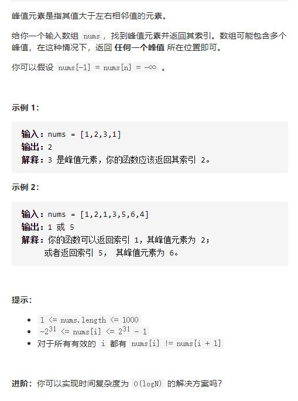

# 162-寻找峰值




## 方法1：二分查找：while (l < r)写法，[left, right)，比较nums[m]与nums[m+1]

首先要注意题目条件，在题目描述中出现了 nums[-1] = nums[n] = -∞，这就代表着 只要数组中存在一个元素比相邻元素大，那么沿着它一定可以找到一个峰值

根据上述结论，我们就可以使用二分查找找到峰值

查找时，左指针 l，右指针 r，以其保持左右顺序为循环条件

根据左右指针计算中间位置 m，并比较 m 与 m+1 的值，如果 m 较大，则左侧存在峰值，r = m，如果 m + 1 较大，则右侧存在峰值，l = m + 1

```js
/**
 * @param {number[]} nums
 * @return {number}
 */
var findPeakElement = function (nums) {
    let l = 0,
        r = nums.length - 1
    while (l < r) {
        let m = l + Math.floor((r - l) / 2)
        if (nums[m] < nums[m + 1]) {
            l = m + 1
        } else {
            //有可能就是m，所以直接缩小到m
            r = m
        }
    }
    return l
};
```


## 方法2：线性扫描

```js
/**
 * @param {number[]} nums
 * @return {number}
 */
var findPeakElement = function (nums) {
    for (let i = 0; i < nums.length - 1; i++) {
        //利用元素不等，且前一个大于后一个一定是峰值
        if (nums[i] > nums[i + 1])
            return i;
    }
    //没有返回则是最后一个元素
    return nums.length - 1;
};
```

