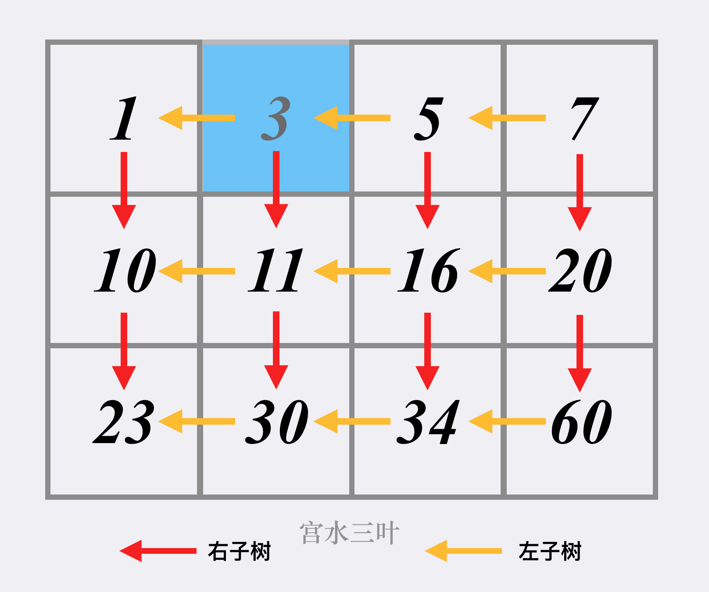

# 74-搜索二维矩阵

编写一个高效的算法来判断 m x n 矩阵中，是否存在一个目标值。该矩阵具有如下特性：

- 每行中的整数从左到右按升序排列。

- 每行的第一个整数大于前一行的最后一个整数。

**示例 1：**


```
输入：matrix = [[1,3,5,7],[10,11,16,20],[23,30,34,60]], target = 3
输出：true
```

**示例 2：**


```
输入：matrix = [[1,3,5,7],[10,11,16,20],[23,30,34,60]], target = 13
输出：false
```

**提示：**

- m == matrix.length

- n == matrix[i].length

- 1 <= m, n <= 100

- -10^4 <= matrix [i] [j]，target <= 10^4


## 方法1：一次二分查找

若将矩阵每一行拼接在上一行的末尾，则会得到一个升序数组，我们可以在该数组上二分找到目标元素。

代码实现时，可以二分升序数组的下标，将其映射到原矩阵的行和列上。

虚拟有序数组的下标与矩阵中行列关系：

- row = mid / matrix[0].length, col = mid % matrix[0].length

```js
//二分查找
var searchMatrix = function (matrix, target) {
    let m = matrix.length;
    let n = matrix[0].length;
    //if (m == 0 || n == 0) return false;
    let left = 0,
        right = m * n - 1;
    while (left <= right) {
        let mid = left + Math.floor((right - left) / 2);
        // 虚拟有序数组的下标与矩阵中行列关系:
        // row = mid / matrix[0].length, col = mid % matrix[0].length
        if (matrix[Math.floor(mid / n)][mid % n] == target) return true;
        if (matrix[Math.floor(mid / n)][mid % n] > target) {
            right = mid - 1;
        } else {
            left = mid + 1;
        }
    }
    return false;
};
```


## 方法2：缩小领域法-右上往左下搜索

**时间复杂度为 O(m+n)**

因为每一行递增，每一列递增。所以我们可以从右上角往左下角找或者从左下角往右上角找。每次比较可以排除一行或者一列

根据题意已知，二维数组从左往右递增，从上往下递增，所以得出以下结论：

某列的某个数字，该数之上的数字，都比其小；

某行的某个数字，该数右侧的数字，都比其大；

所以，解题流程如下所示：

以二维数组左下角为原点，建立直角坐标轴。

若当前数字大于了查找数，查找往上移一位。

若当前数字小于了查找数，查找往右移一位。



```js
//缩小领域法-右上往左下搜索
var searchMatrix = function (matrix, target) {
    let m = matrix.length;
    let n = matrix[0].length;
    //if (m == 0 || n == 0) return false;
    let x = 0,
        y = n - 1;
    // 因为每一行递增，每一列递增。所以我们可以从右上角往左下角找或者从左下角往右上角找。每次比较可以排除一行或者一列，时间复杂度为O(m+n)
    while (x < m && y >= 0) {
        if (matrix[x][y] === target) return true;
        if (matrix[x][y] > target) {
            y--;
        } else {
            x++;
        }
    }
    return false;
};
```

