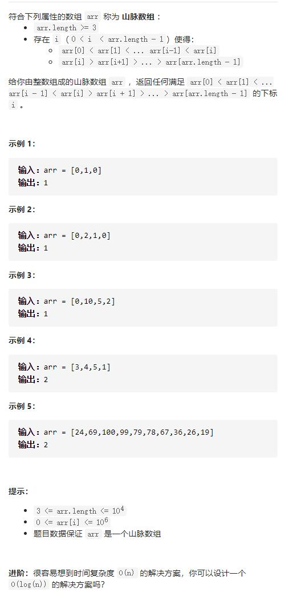

# 852-山脉数组的峰顶索引




## 方法1：二分查找：while (l < r)写法，[left, right)，比较nums[m]与nums[m+1]

```js
/**
 * @param {number[]} arr
 * @return {number}
 */
var peakIndexInMountainArray = function (arr) {
    let l = 0,
        r = arr.length - 1
    while (l < r) {
        let m = l + Math.floor((r - l) / 2)
        if (arr[m] < arr[m + 1]) {
            l = m + 1
        } else {
            //有可能就是m，所以直接缩小到m
            r = m
        }
    }
    return l
};
```


## 方法2：暴力法

```js
var peakIndexInMountainArray = function (arr) {
    for (let i = 0; i < arr.length; i++) {
        if (arr[i] > arr[i + 1]) {
            return i;
        }
    }
    //没找到
    return -1;
};
```

