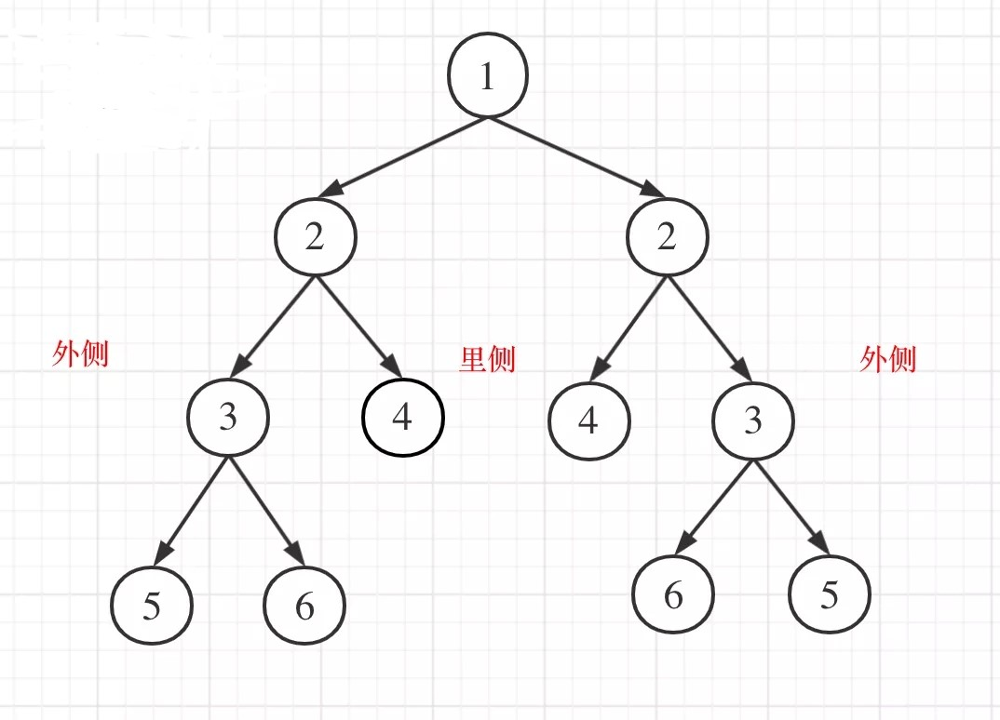

# 101-对称二叉树

### 给定一个二叉树，检查它是否是镜像对称的。

### 例如，二叉树 `[1,2,2,3,4,4,3]` 是对称的。

```
    1
   / \
  2   2
 / \ / \
3  4 4  3
```

但是下面这个 `[1,2,2,null,3,null,3]` 则不是镜像对称的:

```
    1
   / \
  2   2
   \   \
   3    3
```

**进阶：**

- 你可以运用 递归 和 迭代 两种方法解决这个问题吗？


## 方法1：DFS（递归）+ 构造比较函数（自顶向下）

**时间复杂度：O(n)**

**空间复杂度：O(n)**

对于二叉树是否对称，要比较的是根节点的左子树与右子树是不是相互翻转的，理解这一点就知道了**「其实我们要比较的是两个树（这两个树是根节点的左右子树）」**，所以在递归遍历的过程中，也是要同时遍历两棵树。

比较的是两个子树的里侧和外侧的元素是否相等。如图所示：



本题遍历只能是“后序遍历”，因为我们要通过递归函数的返回值来判断两个子树的内侧节点和外侧节点是否相等。

**「正是因为要遍历两棵树而且要比较内侧和外侧节点，所以准确的来说是一个树的遍历顺序是左右中，另一个树的遍历顺序是右左中。」**

但都可以理解算是后序遍历，尽管已经不是严格上在一个树上进行遍历的后序遍历了。

递归步骤

1、确定递归函数的参数和返回值

2、确定终止条件

要比较两个节点数值相不相同，首先要把两个节点为空的情况弄清楚！否则后面比较数值的时候就会操作空指针了。

节点为空的情况有：（**「注意我们比较的其实不是左孩子和右孩子，所以如下我称之为左节点右节点」**）

- 左节点为空，右节点不为空，不对称，return false
- 左不为空，右为空，不对称 return  false
- 左右都为空，对称，返回true

此时已经排除掉了节点为空的情况，那么剩下的就是左右节点不为空：

- 左右都不为空，比较节点数值，不相同就return false

此时左右节点不为空，且数值也不相同的情况我们也处理了。

```js
/**
 * Definition for a binary tree node.
 * function TreeNode(val, left, right) {
 *     this.val = (val===undefined ? 0 : val)
 *     this.left = (left===undefined ? null : left)
 *     this.right = (right===undefined ? null : right)
 * }
 */
/**
 * @param {TreeNode} root
 * @return {boolean}
 */
var isSymmetric = function (root) {
    if (!root) return true
    function check(l, r) {
        if (!l && !r) return true
        if (!l || !r) return false
        if (l.val !== r.val) return false
        return check(l.left, r.right) && check(l.right, r.left)
    }
    return check(root.left, root.right)
};


//以下为详细版
var isSymmetric = function (root) {
    if(root === null) return true
    return check(root, root);
};

var check = function (p, q) {
    //两个节点同时为空则为对称
    if (p === null && q === null) return true
    //两个节点中有一个为空则不为对称
    if (p === null || q === null) return false
    //比较2个节点的值是否相等
    //递归的比较 左节点的左孩子 和 右节点的右孩子
    //以及比较  左节点的右孩子 和 右节点的左孩子
    return (p.val === q.val) && check(p.left, q.right) && check(p.right, q.left)
}

var check = function (p, q) {
    if (p === null && q === null) return true
    if (p === null || q === null) return false
 	if(p.val !== q.val) return false
    return check(p.left, q.right) && check(p.right, q.left)
}
```


## 方法2：迭代法（非层序遍历）

**时间复杂度：O(n)**

**空间复杂度：O(n)**

这里我们可以使用队列来比较两个树（根节点的左右子树）是否相互翻转，（**「注意这不是层序遍历」**）

通过队列来判断根节点的左子树和右子树的内侧和外侧是否相等，如动画所示：


如下的条件判断和递归的逻辑是一样的。

```js
var isSymmetric = function (root) {
    if (!root) return true
    //if (root === null) return true
    let queue = [] //使用队列维护每层的节点
    queue.push(root.left, root.right)
    while (queue.length) {
        let l = queue.shift()
        let r = queue.shift()
        if (!l && !r) continue
        if (!l || !r) return false
        if (l.val !== r.val) return false
        queue.push(l.left, r.right)
        queue.push(l.right, r.left)
    }
    return true
};
```

