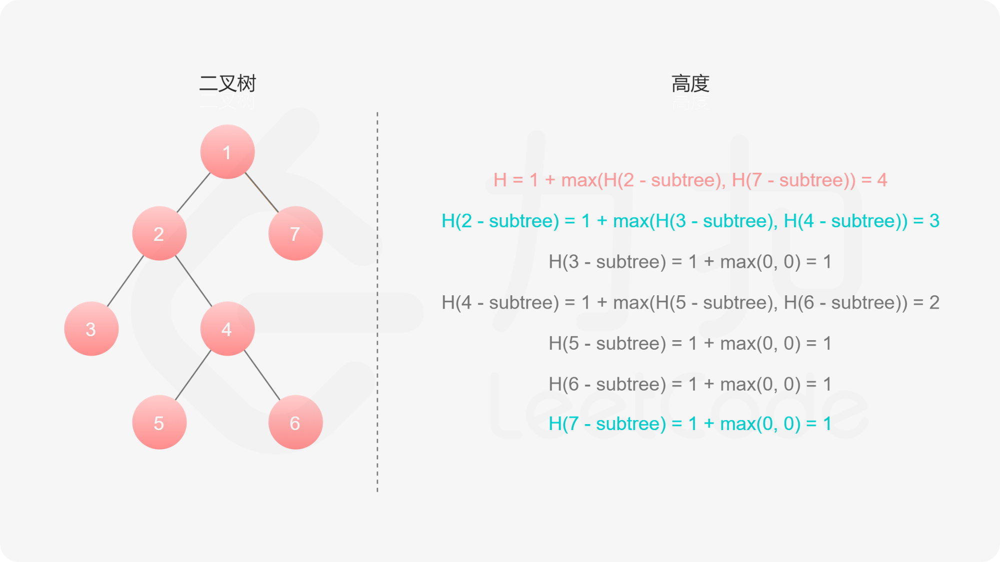

# 104-二叉树的最大深度

### 给定一个二叉树，找出其最大深度。

### 二叉树的深度为根节点到最远叶子节点的最长路径上的节点数。

### 说明: 叶子节点是指没有子节点的节点。

**示例：**

#### 给定二叉树 [3,9,20,null,null,15,7]，

```
    3
   / \
  9  20
    /  \
   15   7
```

#### 返回它的最大深度 3 。


## 方法一：递归（DFS）

#### 时间复杂度：O(n)

#### 空间复杂度：O(height)，其中 height 表示二叉树的高度。

### 如果我们知道了左子树和右子树的最大深度 l 和 r，那么该二叉树的最大深度即为 max(l, r) + 1

### 而左子树和右子树的最大深度又可以以同样的方式进行计算。因此我们在计算当前二叉树的最大深度时，可以先递归计算出其左子树和右子树的最大深度，然后在 O(1) 时间内计算出当前二叉树的最大深度。递归在访问到空节点时退出。

### 图解：



```javascript
var maxDepth = function (root) {
    if (!root) return 0;
    //if (!root.left && !root.right) return 1  // 叶子节点，直接返回
    let left = maxDepth(root.left);
    let right = maxDepth(root.right);
    return Math.max(left, right) + 1;
};

var maxDepth = function (root) {
    if (!root) return 0;
    return Math.max(maxDepth(root.left), maxDepth(root.right)) + 1;
};
```


## （推荐！）方法二：BFS

#### 时间复杂度：O(n)

#### 空间复杂度：O(n)

### 使用迭代法的话，使用层序遍历是最为合适的，因为最大的深度就是二叉树的层数，和层序遍历的方式极其吻合。

### 在二叉树中，一层一层的来遍历二叉树，记录一下遍历的层数就是二叉树的深度

```javascript
/**
 * Definition for a binary tree node.
 * function TreeNode(val, left, right) {
 *     this.val = (val===undefined ? 0 : val)
 *     this.left = (left===undefined ? null : left)
 *     this.right = (right===undefined ? null : right)
 * }
 */
/**
 * @param {TreeNode} root
 * @return {number}
 */
var maxDepth = function (root) {
    if (!root) return 0
    let que = [root],
        dep = 0
    while (que.length) {
        let levelSzie = que.length
        dep++
        for (let i = 0; i < levelSzie; i++) {
            let node = que.shift()
            if (node.left) que.push(node.left)
            if (node.right) que.push(node.right)
        }
 
    }
    return dep
};
```


