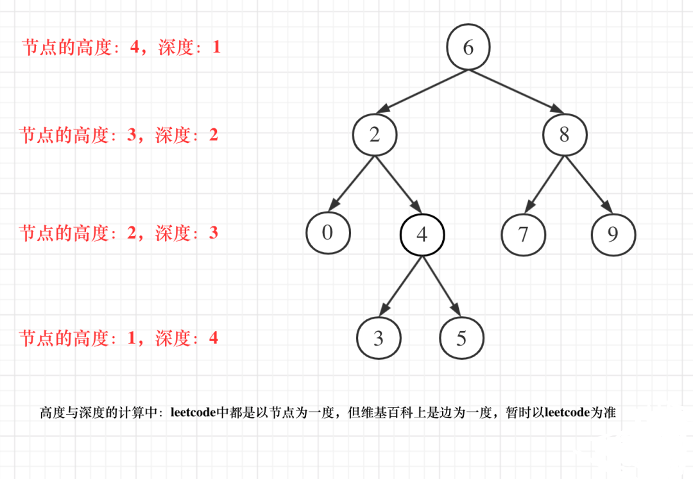

# 110-平衡二叉树

### 给定一个二叉树，判断它是否是高度平衡的二叉树。

### 本题中，一棵高度平衡二叉树定义为：

### 一个二叉树 每个节点 的左右两个子树的高度差的绝对值不超过 1 。

**示例 1：**

```
  3
 / \
9   20
   /  \
  15   7
输入：root = [3,9,20,null,null,15,7]
输出：true
```

**示例 2：**

```
      1
     / \
    2   2
   / \
  3   3
 / \
4   4
输入：root = [1,2,2,3,3,null,null,4,4]
输出：false
```

**示例 3：**

```
输入：root = []
输出：true
```

**提示：**

- 树中的节点数在范围 `[0, 5000]` 内
- `-10^4 <= Node.val <= 10^4`


## 方法1：DFS-从底向上递归（提前阻断）


这里强调一波概念：

- 二叉树节点的深度：指从根节点到该节点的最长简单路径边的条数。
- 二叉树节点的高度：指从该节点到叶子节点的最长简单路径边的条数。

但leetcode中强调的深度和高度很明显是按照节点来计算的，如图：



关于根节点的深度究竟是1 还是 0，不同的地方有不一样的标准，leetcode的题目中都是以节点为一度，即根节点深度是1。但维基百科上定义用边为一度，即根节点的深度是0，我们暂时以leetcode为准（毕竟要在这上面刷题）。

因为求深度可以从上到下去查 所以需要前序遍历（中左右），而高度只能从下到上去查，所以只能后序遍历（左右中）

为什么 求二叉树的最大深度，也用的是后序遍历？

**「那是因为代码的逻辑其实是求的根节点的高度，而根节点的高度就是这颗树的最大深度，所以才可以使用后序遍历。」**

**所以求比较高度，必然是要后序遍历！**

**递归三步曲分析：**

**1.明确递归函数的参数和返回值**

参数的话为传入的节点指针，就没有其他参数需要传递了，返回值要返回传入节点为根节点树的深度。

那么如何标记左右子树是否差值大于1呢。

如果当前传入节点为根节点的二叉树已经不是二叉平衡树了，还返回高度的话就没有意义了。

所以如果已经不是二叉平衡树了，可以返回-1 来标记已经不符合平衡树的规则了。

```java
// -1 表示已经不是平衡二叉树了，否则返回值是以该节点为根节点树的高度
int getHeight(TreeNode node)
```

**2.明确终止条件**

递归的过程中依然是遇到空节点了为终止，返回0，表示当前节点为根节点的高度为0

```js
if (node == NULL) {
    return 0;
}
```

当左（右）子树高度 `left== -1` 时，代表此子树的 **左（右）子树** 不是平衡树，因此直接返回 -1；

**3.明确单层递归的逻辑**

如何判断当前传入节点为根节点的二叉树是否是平衡二叉树呢，当然是左子树高度和右子树高度相差。

分别求出左右子树的高度，然后如果差值小于等于1，则返回当前二叉树的高度，否则则返回-1，表示已经不是二叉树了。（若判定某子树不是平衡树则 “剪枝” ，直接向上返回。）

```js
let leftDepth = depth(node->left); // 左
if (leftDepth == -1) return -1;     
int rightDepth = depth(node->right); // 右
if (rightDepth == -1) return -1;

let result;
if (Math.abs(leftDepth - rightDepth) > 1) {  // 中
    result = -1;
} else {
    result = 1 + max(leftDepth, rightDepth); // 以当前节点为根节点的最大高度
}
return result;
```

此时递归的函数就已经写出来了，这个递归的函数传入节点指针，返回以该节点为根节点的二叉树的高度，如果不是二叉平衡树，则返回-1。

**最后 整体 isBalanced(root) 的返回值：**

若 `getHeight(root) != -1` ，则说明此树平衡，返回 true； 否则返回 false。

#### 完整代码：

```js
/**
 * Definition for a binary tree node.
 * function TreeNode(val, left, right) {
 *     this.val = (val===undefined ? 0 : val)
 *     this.left = (left===undefined ? null : left)
 *     this.right = (right===undefined ? null : right)
 * }
 */
/**
 * @param {TreeNode} root
 * @return {boolean}
 */
var isBalanced = function (root) {
    if (!root) return true
    function getHeight(root) {
        if (!root) return 0
        let left = getHeight(root.left)
        if (left === -1) return -1
        let right = getHeight(root.right)
        if (right === -1) return -1
        // 分别求出左右子树的高度，然后如果差值小于等于1，则返回当前二叉树的高度，否则则返回-1，表示已经不是二叉树了，进行“剪枝”
        return Math.abs(left - right) > 1 ? -1 : 1 + Math.max(left, right)
    }
    return getHeight(root) !== -1
};
```

