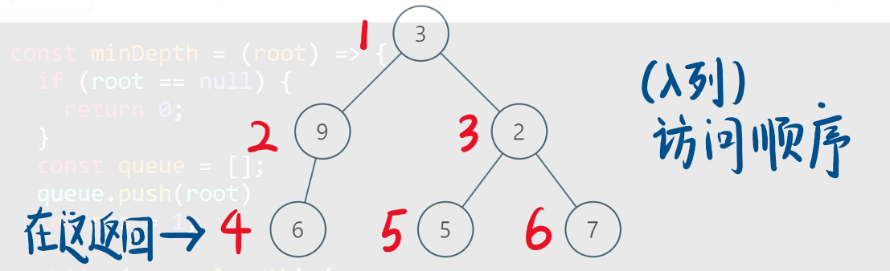

# 111-二叉树的最小深度

### 给定一个二叉树，找出其最小深度。

### 最小深度是从根节点到最近叶子节点的最短路径上的节点数量。

### 说明: 叶子节点是指没有子节点的节点。

#### 示例:

#### 给定二叉树 [3,9,20,null,null,15,7]

```
    3
   / \
  9  20
    /  \
   15   7
```

#### 返回它的最小深度  2

**提示：**

- 树中节点数的范围在 [0, 10^5] 内

- -1000 <= Node.val <= 1000


## 方法一：递归（DFS）

#### 时间复杂度：O(n)

#### 空间复杂度：最坏O(n)，平均O(log n)

### 终止条件、返回值和递归过程：

### 当前节点 root 为空时，说明此处树的高度为 0

### 当 root 节点左右孩子都为空时，返回 1

### 当 root 节点左右孩子有一个为空时，返回不为空的孩子节点的深度，再+1

### 当 root 节点左右孩子都不为空时，返回左右孩子较小深度的节点值，再+1

```javascript
// 官方解法
var minDepth = function (root) {
    if (!root) return 0;
    if (!root.left && !root.right) return 1;
    let mindepth = Infinity;
    if (root.left) mindepth = Math.min(minDepth(root.left), mindepth);
    if (root.right) mindepth = Math.min(minDepth(root.right), mindepth);
    return mindepth + 1;
};

// 优化版
var minDepth = function (root) {
    if (!root) return 0;
    if (!root.left && !root.right) return 1;
    let left = minDepth(root.left);
    let right = minDepth(root.right);
    if (!root.left || !root.right) return left + right + 1;
    return Math.min(left, right) + 1;
};

// 简化版-合并3种为空的情况
var minDepth = function (root) {
    if (!root) return 0;
    let left = minDepth(root.left);
    let right = minDepth(root.right);
    if (!root.left || !root.right) return left + right + 1;
    // 或 if (!left || !right) return left + right + 1;
    return Math.min(left, right) + 1;
};

// 简化版2
var minDepth = function (root) {
    if (!root) return 0;
    let left = minDepth(root.left);
    let right = minDepth(root.right);
    return !root.left || !root.right ? left + right + 1 : Math.min(left, right) + 1;
    // 或 return !left || !right ? left + right + 1 : Math.min(left, right) + 1;
};
```


## 方法二：BFS - 测试的时间较慢，可能由于shift的时间复杂度为O(n) !

#### 时间复杂度：O(n)

#### 空间复杂度：O(n)

### 相对于 104.二叉树的最大深度 ，本题也可以使用层序遍历的方式来解决，思路是一样的。

### 需要注意的是，只有当左右孩子都为空的时候，才说明遍历的最低点了，即返回深度。如果其中一个孩子为空则不是最低点

### 当我们找到一个叶子节点时，直接返回这个叶子节点的深度。广度优先搜索的性质保证了最先搜索到的叶子节点的深度一定最小。



```javascript
/**
 * Definition for a binary tree node.
 * function TreeNode(val, left, right) {
 *     this.val = (val===undefined ? 0 : val)
 *     this.left = (left===undefined ? null : left)
 *     this.right = (right===undefined ? null : right)
 * }
 */
/**
 * @param {TreeNode} root
 * @return {number}
 */
var minDepth = function (root) {
    if (!root) return 0
    let que = [root],
        dep = 0
    while (que.length) {
        let levelSzie = que.length
        dep++
        for (let i = 0; i < levelSzie; i++) {
            let node = que.shift()
            if (!node.left && !node.right) {
                return dep
            }
            if (node.left) que.push(node.left)
            if (node.right) que.push(node.right)
        }
    }
    return 0
};
```

