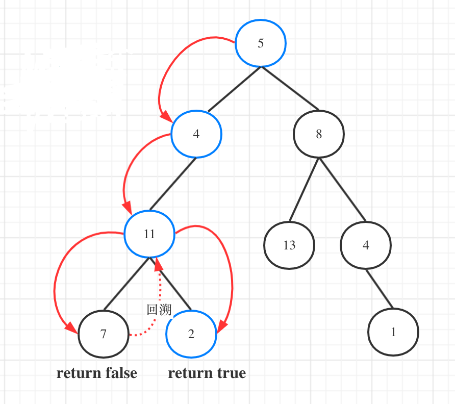

# 112-路径总和

### 给你二叉树的根节点 root 和一个表示目标和的整数 targetSum ，判断该树中是否存在 根节点到叶子节点 的路径，这条路径上所有节点值相加等于目标和 targetSum 。

### 叶子节点 是指没有子节点的节点。

**示例 1：**


```
输入：root = [5,4,8,11,null,13,4,7,2,null,null,null,1], targetSum = 22
输出：true
```

**示例 2：**


```
输入：root = [1,2,3], targetSum = 5
输出：false
```

**示例 3：**

```
输入：root = [1,2], targetSum = 0
输出：false
```

**提示：**

- 树中节点的数目在范围 [0, 5000] 内
- -1000 <= Node.val <= 1000
- -1000 <= targetSum <= 1000


## 方法1：DFS递归-不分遍历方式，都可

**时间复杂度：O（n）**

可以使用深度优先遍历的方式（本题前中后序都可以，无所谓，因为中节点也没有处理逻辑）来遍历二叉树

**1.确定递归函数的参数和返回类型**

参数：需要二叉树的根节点，还需要一个计数器，这个计数器用来计算二叉树的一条边之和是否正好是目标和。

**「再来看返回值，递归函数什么时候需要返回值？什么时候不需要返回值？」**

**答案：「如果需要搜索整颗二叉树，那么递归函数就不要返回值，如果要搜索其中一条符合条件的路径，递归函数就需要返回值，因为遇到符合条件的路径了就要及时返回。」**

而本题我们要找一条符合条件的路径，所以递归函数需要返回值，及时返回，那么返回类型是什么呢？



图中可以看出，遍历的路线，并不要遍历整棵树，所以递归函数需要返回值，可以用bool类型表示。

```java
bool traversal(TreeNode cur, int count)   // 注意函数的返回类型
```

**2.确定终止条件**

首先计数器如何统计这一条路径的和呢？

**不要去累加然后判断是否等于目标和，那么代码比较麻烦，可以用递减，让计数器count初始为目标和，然后每次减去遍历路径节点上的数值。**

如果最后count === 0，同时到了叶子节点的话，说明找到了目标和。

如果遍历到了叶子节点，count不为0，就是没找到。

递归终止条件代码如下：

```js
if (!cur->left && !cur->right && count == 0) return true; // 遇到叶子节点，并且计数为0
if (!cur->left && !cur->right) return false; // 遇到叶子节点而没有找到合适的边，直接返回
```

3.确定单层递归的逻辑

因为终止条件是判断叶子节点，所以递归的过程中就不要让空节点进入递归了。

递归函数是有返回值的，如果递归函数返回true，说明找到了合适的路径，应该立刻返回。

代码如下：

```js
if (cur->left) { // 左 （空节点不遍历）
    // 左子树遇到叶子节点，并且计数为0，返回true，则最后直接返回true
    if (traversal(cur->left, count - cur->left->val)) return true; // 注意这里有回溯的逻辑
}
if (cur->right) { // 右 （空节点不遍历）
    // 右子树遇到叶子节点，并且计数为0，返回true，则最后直接返回true
    if (traversal(cur->right, count - cur->right->val)) return true; // 注意这里有回溯的逻辑
}
return false;
```

#### 完整代码：

```js
/**
 * Definition for a binary tree node.
 * function TreeNode(val, left, right) {
 *     this.val = (val===undefined ? 0 : val)
 *     this.left = (left===undefined ? null : left)
 *     this.right = (right===undefined ? null : right)
 * }
 */
/**
 * @param {TreeNode} root
 * @param {number} targetSum
 * @return {boolean}
 */
var hasPathSum = function (root, targetSum) {
    if (!root) return false
    function dfs(root, sum) {
        if (!root.left && !root.right && sum === 0) return true
        if (!root.left && !root.right) return false
        if (root.left) {
            if (dfs(root.left, sum - root.left.val)) return true
        }
        if (root.right) {
            if (dfs(root.right, sum - root.right.val)) return true
        }
        return false
    }
    return dfs(root, targetSum - root.val)
};


//简化写法-隐藏逻辑！
var hasPathSum = function (root, targetSum) {
    if (root === null) return false;
    if (!root.left && !root.right && targetSum == root.val) {
        return true;
    }
    return hasPathSum(root.left, targetSum - root.val) || hasPathSum(root.right, targetSum - root.val);
};
```

## 方法2：迭代-栈实现

```js
var hasPathSum = function (root, targetSum) {
    if (!root) return false
    let st = [root],
        sum = [targetSum - root.val]
    while (st.length) {
        let cur = st.pop()
        let curSum = sum.pop()
        if (!cur.left && !cur.right && curSum === 0) return true
        if (cur.left) {
            st.push(cur.left)
            sum.push(curSum - cur.left.val)
        }
        if (cur.right) {
            st.push(cur.right)
            sum.push(curSum - cur.right.val)
        }
    }
    return false
};
```

