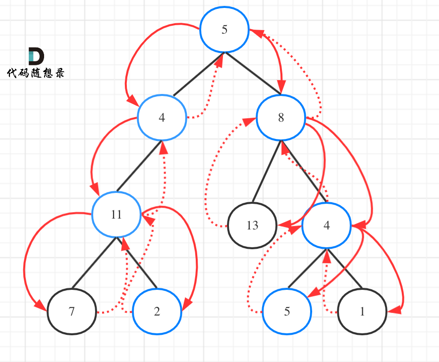

# 113-路径总和 II

### 给你二叉树的根节点 root 和一个整数目标和 targetSum ，找出所有 从根节点到叶子节点 路径总和等于给定目标和的路径。

### 叶子节点 是指没有子节点的节点。

**示例 1：**


```
输入：root = [5,4,8,11,null,13,4,7,2,null,null,5,1], targetSum = 22
输出：[[5,4,11,2],[5,8,4,5]]
```

**示例 2：**


```
输入：root = [1,2,3], targetSum = 5
输出：[]
```

**示例 3：**

```
输入：root = [1,2], targetSum = 0
输出：[]
```

**提示：**

- 树中节点总数在范围 `[0, 5000]` 内
- `-1000 <= Node.val <= 1000`
- `-1000 <= targetSum <= 1000`


## 方法1：DFS回溯

**时间复杂度：O（n^2）**



```js
/**
 * Definition for a binary tree node.
 * function TreeNode(val, left, right) {
 *     this.val = (val===undefined ? 0 : val)
 *     this.left = (left===undefined ? null : left)
 *     this.right = (right===undefined ? null : right)
 * }
 */
/**
 * @param {TreeNode} root
 * @param {number} targetSum
 * @return {number[][]}
 */
// 回溯法
// 要遍历整个树找到所有路径，所以递归函数不需要返回值, 与112不同
var pathSum = function (root, targetSum) {
    if (!root) return []
    let res = [],
        path = [root.val]
    function dfs(cur, sum) {
        // 遇到了叶子节点且找到了和为sum的路径
        if (!cur.left && !cur.right && sum === 0) {
            //此处不能写res.push(path), 要深拷贝，不然回溯path会被污染
            res.push([...path])
            return
        }
        // 遇到叶子节点而没有找到合适的边，直接返回
        if (!cur.left && !cur.right) return
        if (cur.left) {
            // 注意回溯
            path.push(cur.left.val)
            dfs(cur.left, sum - cur.left.val)
            path.pop()
        }
        if (cur.right) {
            // 注意回溯
            path.push(cur.right.val)
            dfs(cur.right, sum - cur.right.val)
            path.pop()
        }
    }
    dfs(root, targetSum - root.val)
    return res
};

// 回溯法2
var pathSum = function (root, targetSum) {
    if (!root) return []
    let res = [],
        path = []
    function dfs(cur, sum) {
        //如果节点为空直接返回
        if (!cur) return;
        path.push(cur.val);
        sum -= cur.val;
        // 遇到了叶子节点且找到了和为sum的路径
        if (!cur.left && !cur.right && sum === 0) {
            //此处不能写res.push(path), 要深拷贝，不然回溯path会被污染
            res.push([...path])
        }
        dfs(cur.left, sum)
        dfs(cur.right, sum)
        path.pop()
    }
    dfs(root, targetSum)
    return res
};
```

