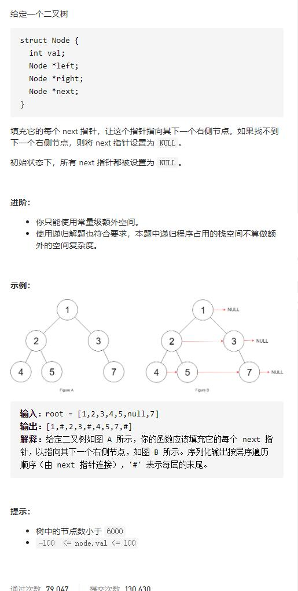

# 116-117-填充每个节点的下一个右侧节点指针、填充每个节点的下一个右侧节点指针II


**提示：**

- 树中节点的数量少于 `4096`
- `-1000 <= node.val <= 1000`





#### 两题代码一样！！！

## 方法1：BFS

### 本题依然是层序遍历，只不过在单层遍历的时候记录一下本层的头部节点，然后在遍历的时候让前一个节点指向本节点就可以了

```js
/**
 * // Definition for a Node.
 * function Node(val, left, right, next) {
 *    this.val = val === undefined ? null : val;
 *    this.left = left === undefined ? null : left;
 *    this.right = right === undefined ? null : right;
 *    this.next = next === undefined ? null : next;
 * };
 */

/**
 * @param {Node} root
 * @return {Node}
 */
var connect = function (root) {
    if (!root) return root
    let que = [root]
    while (que.length) {
        let levelSize = que.length
        let preNode
        for (let i = 0; i < levelSize; i++) {
            let node = que.shift()
            if (i === 0) {
                preNode = node
            } else {
                preNode.next = node
                preNode = node
            }
            if (node.left) que.push(node.left)
            if (node.right) que.push(node.right)
        }
        preNode.next = null
    }
    return root
};
```

