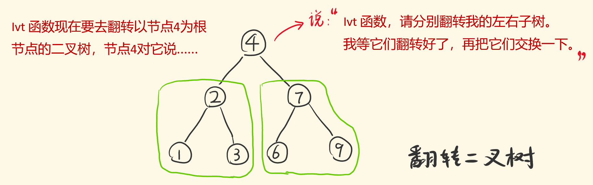
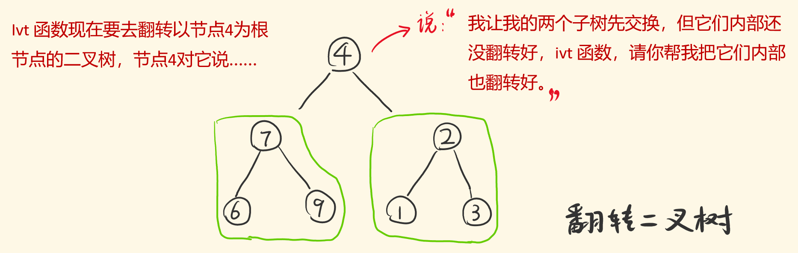

# 226-翻转二叉树

### 翻转一棵二叉树。

**示例：**

**输入：**

```
     4
   /   \
  2     7
 / \   / \
1   3 6   9
```

**输出：**

```
     4
   /   \
  7     2
 / \   / \
9   6 3   1
```


## 方法一：递归（DFS）

#### 时间复杂度：O(n)

#### 空间复杂度：O(n)

### 一个二叉树，怎么才算翻转了？

### 它的左右子树要交换，并且左右子树内部的所有子树，都要进行左右子树的交换。

### 1.先翻转子树内部，再翻转外部子树

#### 后序遍历：将「对节点的处理操作」放到了「递归右子树」之后！



```javascript
// 官方解法
var invertTree = function (root) {
    if (!root) return null;
    let left = invertTree(root.left);
    let right = invertTree(root.right);
    root.left = right;
    root.right = left;
    return root;
};

// 解2
var invertTree = function (root) {
    if (!root) return null;
    invertTree(root.left);
    invertTree(root.right);
    let temp = root.left;
    root.left = root.right;
    root.right = temp;
    return root;
};
```


### 2.先翻转两子树，再翻转子树内部

#### 前序遍历：将「对节点的处理操作」放到了「递归左子树」之前。



```javascript
var invertTree = function (root) {
    if (!root) return null;
    let temp = root.left;
    root.left = root.right;
    root.right = temp;
    invertTree(root.left);
    invertTree(root.right);
    return root;
};

//前序遍历迭代法
/**
 * Definition for a binary tree node.
 * function TreeNode(val, left, right) {
 *     this.val = (val===undefined ? 0 : val)
 *     this.left = (left===undefined ? null : left)
 *     this.right = (right===undefined ? null : right)
 * }
 */
/**
 * @param {TreeNode} root
 * @return {TreeNode}
 */
var invertTree = function (root) {
    if (!root) return root
    let st = [root]
    while (st.length) {
        let node = st.pop()
        let tmp = node.left
        node.left = node.right
        node.right = tmp
        if (node.right) st.push(node.right)
        if (node.left) st.push(node.left)
    }
    return root
};
```


## 方法2：BFS

#### 时间复杂度：O(n)

#### 空间复杂度：O(n)

### 在放入que之前，反转左右子树

```js
/**
 * Definition for a binary tree node.
 * function TreeNode(val, left, right) {
 *     this.val = (val===undefined ? 0 : val)
 *     this.left = (left===undefined ? null : left)
 *     this.right = (right===undefined ? null : right)
 * }
 */
/**
 * @param {TreeNode} root
 * @return {TreeNode}
 */
var invertTree = function (root) {
    if (!root) return root
    let que = [root]
    while (que.length) {
        let levelSize = que.length
        for (let i = 0; i < levelSize; i++) {
            let node = que.shift()
            let tmp = node.left
            node.left = node.right
            node.right = tmp
            if (node.left) que.push(node.left)
            if (node.right) que.push(node.right)
        }
    }
    return root
};
```

