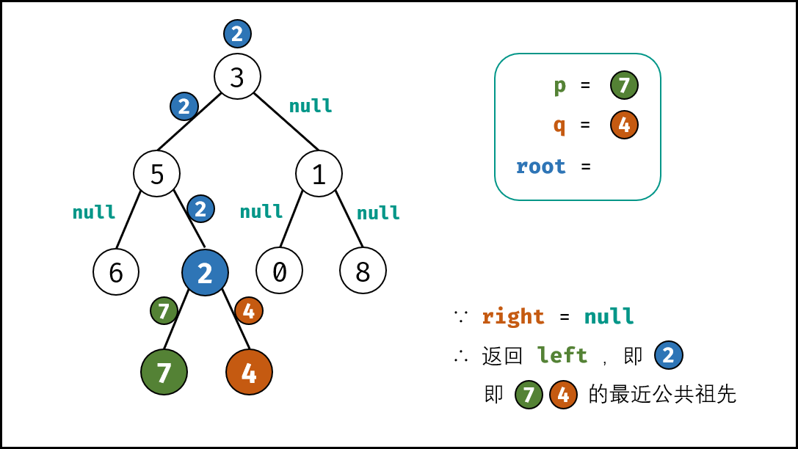

# 236-二叉树的最近公共祖先

### 给定一个二叉树, 找到该树中两个指定节点的最近公共祖先。

### 百度百科中最近公共祖先的定义为：“对于有根树 T 的两个结点 p、q，最近公共祖先表示为一个结点 x，满足 x 是 p、q 的祖先且 x 的深度尽可能大（一个节点也可以是它自己的祖先）。”

#### 例如，给定如下二叉树:  root = [3,5,1,6,2,0,8,null,null,7,4]


**示例 1:**

```
输入: root = [3,5,1,6,2,0,8,null,null,7,4], p = 5, q = 1
输出: 3
解释: 节点 5 和节点 1 的最近公共祖先是节点 3
```

**示例 2:**

```
输入: root = [3,5,1,6,2,0,8,null,null,7,4], p = 5, q = 4
输出: 5
解释: 节点 5 和节点 4 的最近公共祖先是节点 5。因为根据定义最近公共祖先节点可以为节点本身
```

**提示：**

- 树中节点数目在范围 [2, 10^5] 内。

- -10^9 <= Node.val <= 10^9

- **所有 Node.val 互不相同 。**

- **p  !=  q**

- p 和 q 均存在于给定的二叉树中。


## 方法一：DFS递归

#### 时间复杂度：O(n)

#### 空间复杂度：O(n)

### 根据以上定义，若 root 是 p, q 的 最近公共祖先 ，则只可能为以下情况之一：

#### 1）p 和 q 在 root 的子树中，且分列 root 的 异侧（即分别在左、右子树中）；

#### 2）p = root ，且 q 在 root 的左或右子树中；

#### 3）q = root ，且 p 在 root 的左或右子树中；


#### 考虑通过递归对二叉树进行先序遍历，当遇到节点 p 或 q 时返回。从底至顶回溯。

## 递归分析：

### 1.终止条件：

#### 当经过叶节点，则直接返回 null

#### 当 root 等于 p, q，则直接返回 root

### 2.递推工作：

#### 开启递归左子节点，返回值记为 left

#### 开启递归右子节点，返回值记为 right

### 3.返回值： 根据 left 和 right，可展开为四种情况；

#### 1）当 left 和 right 同时为空：说明 root 的左 / 右子树中都不包含 p,q，返回 null

#### 2）当 left 和 right 同时不为空：说明 p, q 分列在 root 的 异侧 （分别在 左 / 右子树），因此 root 为最近公共祖先，返回 root；

#### 3）当 left 为空，right 不为空：p,q 都不在 root 的左子树中，直接返回 right

#### 具体可分为两种情况：

##### p, q 其中一个在 root 的 右子树 中，此时 right 指向 p（假设为 p ）；

##### p, q 两节点都在 root 的 右子树 中，此时的 right 指向 最近公共祖先节点 ；

#### 4）当 left 不为空，right 为空：p,q 都不在 root 的右子树中，直接返回 left

#### 具体与情况  3） 同理；

**观察发现， 情况 1） 可合并至  3） 和  4） 内！**



```javascript
//标准写法-情况1合并到3和4里面
var lowestCommonAncestor = function (root, p, q) {
    if (!root) return null;
    if (root === p || root === q) return root;
    let left = lowestCommonAncestor(root.left, p, q);
    let right = lowestCommonAncestor(root.right, p, q);
    if (!left) return right;
    if (!right) return left;
    return root;
};

//简化版
var lowestCommonAncestor = function (root, p, q) {
    if (!root || root === p || root === q) return root;
    let left = lowestCommonAncestor(root.left, p, q);
    let right = lowestCommonAncestor(root.right, p, q);
    if (!left) return right;
    if (!right) return left;
    return root;
};

//详细版-4种情况
var lowestCommonAncestor = function (root, p, q) {
    if (!root) return null;
    if (root === p || root === q) return root;
    let left = lowestCommonAncestor(root.left, p, q);
    let right = lowestCommonAncestor(root.right, p, q);
    if (!left && !right) return null; //情况1
    if (!left) return right; //情况3
    if (!right) return left; //情况4
    return root; //情况2，p, q在异侧，直接返回root
};
```

