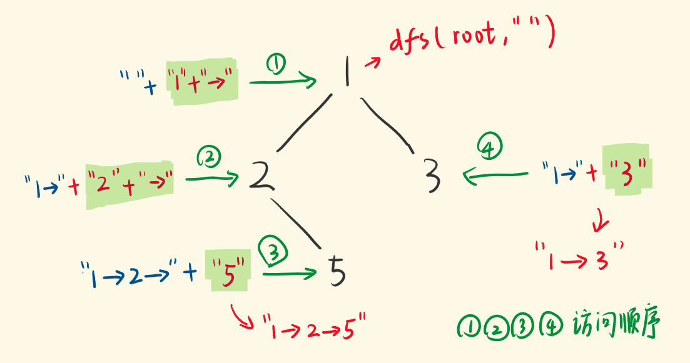

# 257-二叉树的所有路径

### 给定一个二叉树，返回所有从根节点到叶子节点的路径。

### 说明: 叶子节点是指没有子节点的节点。

**示例:**

```javascript
输入:

   1
 /   \
2     3
 \
  5

输出: ["1->2->5", "1->3"]

解释: 所有根节点到叶子节点的路径为: 1->2->5, 1->3
```


## 方法一：DFS递归-隐含回溯

#### 时间复杂度：O(n^2)

#### 空间复杂度：O(n^2)

### 二叉树前序DFS法

**1.递归函数函数参数以及返回值**

要传入根节点，记录每一条路径的path，这里递归不需要返回值，



```javascript

var binaryTreePaths = function (root) {
    if (!root) return []
    let res = []
    const dfs = (root, pathStr) => {
        if (!root.left && !root.right) {
            pathStr += root.val
            res.push(pathStr)
            return
        }
        //pathStr += root.val + "->"
        if (root.left) dfs(root.left, pathStr + root.val + "->")
        if (root.right) dfs(root.right, pathStr + root.val + "->")  // 注意这里传的是pathStr，是当前root下的str，字符串特点，暗含了回溯了，
    }
    dfs(root, "")
    return res
};

//写法2
var binaryTreePaths = function (root) {
    if (!root) return []
    let res = []
    const dfs = (root, pathStr) => {
        pathStr += root.val
        if (!root.left && !root.right) {
            res.push(pathStr)
            return
        }
        if (root.left) dfs(root.left, pathStr + "->")
        if (root.right) dfs(root.right, pathStr + "->")  // 注意这里传的是pathStr，是当前root下的str，字符串特点，暗含了回溯了，
    }
    dfs(root, "")
    return res
};
```


## 方法二：迭代（手动实现栈）

#### 时间复杂度：O(n^2)

#### 空间复杂度：O(n^2)

### 二叉树前序的迭代法

```javascript
var binaryTreePaths = function (root) {
    if (!root) return []
    let res = []
    let st = []
    let pathst = []  // 保存遍历路径的字符串数组
    // 当前节点和路径同时入栈
    st.push(root)
    pathst.push(root.val.toString())
    while (st.length) {
        let node = st.pop()
        let path = pathst.pop()  // 取出该节点对应的路径
        if (!node.left && !node.right) {
            res.push(path)
        }
        if (node.right) {
            st.push(node.right)
            pathst.push(path + '->' + node.right.val)
        }
        if (node.left) {
            st.push(node.left)
            pathst.push(path + '->' + node.left.val)
        }
    }
    return res
};
```

