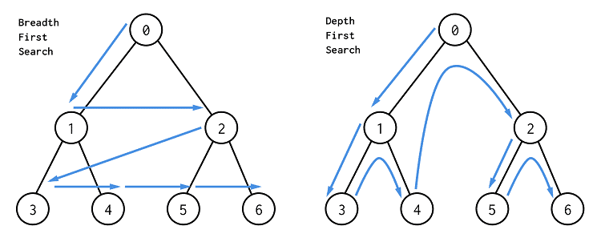

# 102-二叉树的层次遍历

## 给你一个二叉树，请你返回其按 层序遍历 得到的节点值。（即逐层地，从左到右访问所有节点）。

### 示例：

## 二叉树：[3,9,20,null,null,15,7],

```
    3
   / \
  9  20
    /  \
   15   7
```

## 返回其层次遍历结果：

```
[
  [3],
  [9,20],
  [15,7]
]
```


## （推荐！）方法一：广度优先搜索（BFS）

## 此代码作为层序遍历的模板使用！！！

#### 时间复杂度：O(n)

#### 空间复杂度：O(n)

#### BFS与DFS的区别图解：



#### BFS需要使用队列辅助

初始化队列 q，并将根节点 root 加入到队列中；

当队列不为空时：

- 队列中弹出节点 node，加入到结果中；

- 如果左子树非空，左子树加入队列；

- 如果右子树非空，右子树加入队列；


```javascript
var levelOrder = function (root) {
    if (!root) return []
    let res = []
    let queue = []
    //将根节点放入队列中，然后不断遍历队列
    queue.push(root)
    while (queue.length) {
        //获取当前队列的长度，这个长度相当于 当前这一层的节点个数
        let currentLevelSize = queue.length
        let curLevNodes = []
        // 变量 i 无实际意义，只是为了循环 currentLevelSize 次
        for (let i = 0; i < currentLevelSize; i++) {
            let node = queue.shift()
            curLevNodes.push(node.val)
            if (node.left) queue.push(node.left)
            if (node.right) queue.push(node.right)
        }
        //将一层的数组加入最终返回结果中
        res.push(curLevNodes)
    }
    return res
};

//写法2
/**
 * Definition for a binary tree node.
 * function TreeNode(val, left, right) {
 *     this.val = (val===undefined ? 0 : val)
 *     this.left = (left===undefined ? null : left)
 *     this.right = (right===undefined ? null : right)
 * }
 */
/**
 * @param {TreeNode} root
 * @return {number[][]}
 */
var levelOrder = function (root) {
    if (!root) return []
    let res = [],
        que = [root]
    while (que.length) {
        let levelSize = que.length
        let level = []
        while (levelSize--) {
            let node = que.shift()
            level.push(node.val)
            if (node.left) que.push(node.left)
            if (node.right) que.push(node.right)
        }
        res.push(level)
    }
    return res
};
```


## （了解）方法二：DFS递归

### 时间复杂度：O(n)

### 空间复杂度：O(n)

```javascript
var levelOrder = function (root) {
    if (!root) return []
    let res = []
    function dfs(index, root) {
        if (!root) return
        if (!res[index]) res[index] = []
        //if (index == res.length) res[index] = []
        res[index].push(root.val)
        if (root.left) dfs(index + 1, root.left)
        if (root.right) dfs(index + 1, root.right)
    }
    dfs(0, root)
    return res
};
```


## （了解！）BFS模板 / 此题代码也可作为模板使用！

```javascript
level = 0  // 记录层数，不需要可以删除
while queue 不空：
    size = queue.size()
    while (size --) {
        cur = queue.shift() //从头出队
        for 节点 in cur的所有相邻节点： //二叉树不用
            if 该节点有效且未被访问过：  // 图需要判断，树不需要！
                queue.push(该节点)
    }
    level ++;
```

