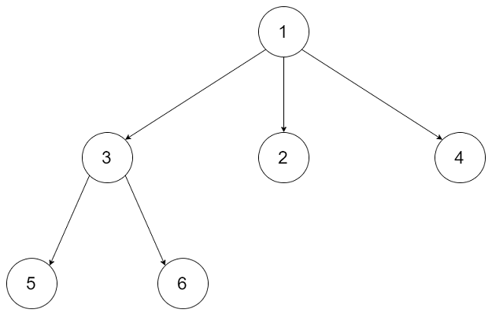

# 589-N叉树的前序遍历

## 给定一个 N 叉树，返回其节点值的*前序遍历*。

## 从例如，给定一个 `3叉树` :



### 返回其前序遍历: `[1,3,5,6,2,4]`。


## 方法一：DFS递归（隐藏栈）

### 时间复杂度：O(n)

### 空间复杂度：O(n)

### 递归算法五步：（重点！）

### 1.确定递归函数的参数和返回值

### 2.确定终止条件

### 3.确定单层递归的逻辑

### 4.下探到下一层

### 5.清理当前层

```javascript
//递归
var preorder = function (root) {
    if (!root) return [];
    const res = [];
    const pre = root => {
        if (!root) return; //终止条件
        res.push(root.val);
        root.children.forEach(item => {
            pre(item);
        });
    }
    pre(root);
    return res;
};
```


## ( 重点！) 方法二：栈（手动实现）

### 时间复杂度：O(n)

### 空间复杂度：O(n)

### 使用一个栈来帮助我们得到前序遍历，需要保证栈顶的节点就是我们当前遍历到的节点。我们首先把根节点入栈，因为根节点是前序遍历中的第一个节点。

### 随后每次我们从栈顶取出一个节点 u，它是我们当前遍历到的节点，并把 u 的所有子节点逆序推入栈中。

### 例如 u 的子节点从左到右为 v1, v2, v3，那么推入栈的顺序应当为 v3, v2, v1，这样就保证了下一个遍历到的节点（即 u 的第一个子节点 v1）出现在栈顶的位置。

### 图解：类似于二叉树的前序遍历！


```javascript
var preorder = function (root) {
    if (!root) return [];
    let res = [];
    let st = [];
    st.push(root);
    while (st.length) { //注意循环只看栈不为空
        root = st.pop();
        res.push(root.val);
        for (let i = root.children.length - 1; i >= 0; i--) {
            st.push(root.children[i]);
        }
    }
    return res;
};
```

