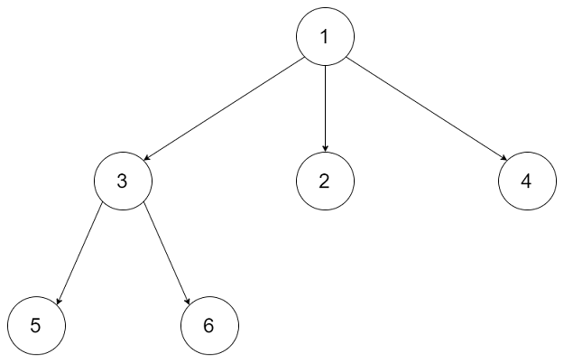

# 590-N叉树的后序遍历

## 给定一个 N 叉树，返回其节点值的*后序遍历*。

## 从例如，给定一个 `3叉树` :



### 返回其后序遍历: `[5,6,3,2,4,1]`。


## 方法一：递归（隐藏栈）

### 时间复杂度：O(n)

### 空间复杂度：O(n)

### 递归算法五步：（重点！）

### 1.确定递归函数的参数和返回值

### 2.确定终止条件

### 3.确定单层递归的逻辑

### 4.下探到下一层

### 5.清理当前层

```javascript
//递归
var postorder = function (root) {
    if (!root) return [];
    const res = [];
    const post = root => {
        if (!root) return; //终止条件
        root.children.forEach(item => {
            post(item);
        });
        res.push(root.val);
    }
    post(root);
    return res;
};
```


## ( 重点！) 方法二：栈（手动实现）

### 时间复杂度：O(n)

### 空间复杂度：O(n)

### 图解：类似于二叉树的后序遍历！

### 先序遍历是中左右，后续遍历是左右中，那么我们只需要调整一下先序遍历的代码顺序，就变成中右左的遍历顺序，然后在反转result数组，输出的结果顺序就是左右中了。


```javascript
var postorder = function (root) {
    if (!root) return [];
    let res = [];
    let st = [];
    st.push(root);
    while (st.length) {
        root = st.pop();
        res.push(root.val);
        root.children.forEach(item => {
            st.push(item)
        });
    }
    res.reverse();
    return res;
};
```

