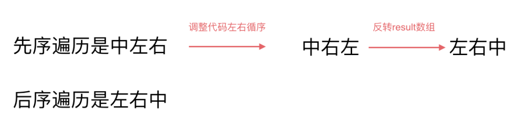
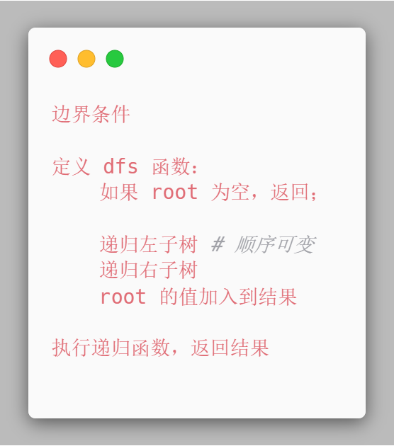
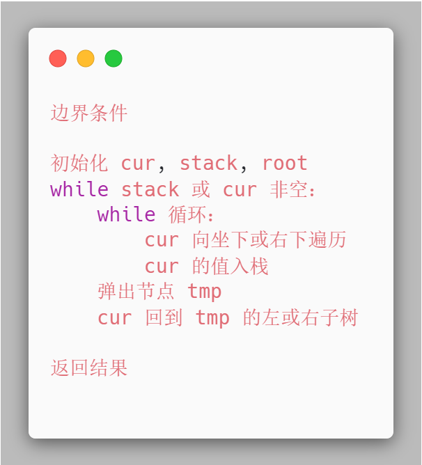

# 94-144-145二叉树的中序、前序和后序遍历

## 给定一个二叉树，返回它的中序 / 前序 / 后序 遍历。

**提示：**

- 树中节点数目在范围 `[0, 100]` 内
- `-100 <= Node.val <= 100`

**进阶：**递归算法很简单，你可以通过迭代算法完成吗？

## 示例:

```
1.中序
输入: [1,null,2,3]
   1
    \
     2s
    /
   3

输出: [1,3,2]

2.前序
输入: [1,null,2,3]  
   1
    \
     2
    /
   3 

输出: [1,2,3]

3.后序
输入: [1,null,2,3]  
   1
    \
     2
    /
   3 

输出: [3,2,1]

```


### 二叉树的遍历方式

- 深度优先遍历

- - 前序遍历（递归法，迭代法）
  - 中序遍历（递归法，迭代法）
  - 后序遍历（递归法，迭代法）

- 广度优先遍历

- - 层次遍历（迭代法）

**这里前中后，其实指的就是中间节点的遍历顺序**

## 方法一：递归-DFS（隐藏栈）---  三种遍历此方法仅代码顺序区别，其他都一样

#### 时间复杂度：O(n)

#### 空间复杂度：O(n)

### 递归算法五步：（重点！）

### 1.确定递归函数的参数和返回值

### 2.确定终止条件

### 3.确定单层递归的逻辑

### 4.下探到下一层

### 5.清理当前层

```javascript
/**
 * Definition for a binary tree node.
 * function TreeNode(val, left, right) {
 *     this.val = (val===undefined ? 0 : val)
 *     this.left = (left===undefined ? null : left)
 *     this.right = (right===undefined ? null : right)
 * }
 */
//中序
var inorderTraversal = function (root) {
    if (!root) return [];
    const res = [];
    const inorder = root => {
        if (!root) return;
        inorder(root.left);
        res.push(root.val);
        inorder(root.right);
    }
    inorder(root);
    return res;
};

//前序
var preorderTraversal = function (root) {
    if (!root) return [];
    const res = [];
    const preorder = root => {
        if (!root) return;
        res.push(root.val);
        preorder(root.left);
        preorder(root.right);
    }
    preorder(root);
    return res;
};

//后序
var postorderTraversal = function (root) {
    if (!root) return [];
    const res = [];
    const postorder = root => {
        if(!root) return;
        postorder(root.left);
        postorder(root.right);
        res.push(root.val);
    }
    postorder(root);
    return res;
};
```


## ( 重点！) 方法二：栈（手动实现）---  此方法前序和后序类似，中序比较独特

### 时间复杂度：O(n)

### 空间复杂度：O(n)

### 1.前序

### 前序遍历是中左右，每次先处理的是中间节点，那么先将根节点放入栈中，然后将右孩子加入栈，再加入左孩子。

### 前序遍历图解：


### 2.后序

### 先序遍历是中左右，后续遍历是左右中，那么我们只需要调整一下先序遍历的代码顺序，就变成中右左的遍历顺序，然后在反转result数组，输出的结果顺序就是左右中了。



### 3.中序

为了解释清楚，我说明一下 刚刚在迭代的过程中，其实我们有两个操作：

1. **处理：将元素放进result数组中**
2. **访问：遍历节点**

分析一下为什么刚刚写的前序遍历的代码，不能和中序遍历通用呢，因为前序遍历的顺序是中左右，先访问的元素是中间节点，要处理的元素也是中间节点，所以刚刚才能写出相对简洁的代码，**因为要访问的元素和要处理的元素顺序是一致的，都是中间节点。**

那么再看看中序遍历，中序遍历是左中右，先访问的是二叉树顶部的节点，然后一层一层向下访问，直到到达树左面的最底部，再开始处理节点（也就是在把节点的数值放进result数组中），这就造成了**处理顺序和访问顺序是不一致的。**

那么**在使用迭代法写中序遍历，就需要借用指针的遍历来帮助访问节点，栈则用来处理节点上的元素。**


### 递归的调用过程是不断往左边走，当左边走不下去了，就打印节点，并转向右边，然后右边继续这个过程。我们在迭代实现时，就可以用栈来模拟上面的调用过程。

### 具体逻辑：

### 1.不断往左子树方向走，每走一次就将当前节点保存到栈中（模拟递归的调用）

### 2.当前节点为空，说明左边走到头了，从栈中弹出节点并保存

### 3.然后转向右边节点，继续上面整个过程

### 具体逻辑结合代码去看比较好！！！

### 中序遍历图解：


```javascript
/**
 * Definition for a binary tree node.
 * function TreeNode(val, left, right) {
 *     this.val = (val===undefined ? 0 : val)
 *     this.left = (left===undefined ? null : left)
 *     this.right = (right===undefined ? null : right)
 * }
 */
//前序
var preorderTraversal = function (root) {
    if (!root) return [];
    let res = [];
    let st = [];
    st.push(root);
    while (st.length) {
        root = st.pop();
        res.push(root.val);
        //不为空的节点放入栈
        if (root.right) st.push(root.right);
        if (root.left) st.push(root.left);
    }
    return res;
};

//模板解法
var preorderTraversal = function (root) {
    if (!root) return [];
    let res = [];
    let st = [];
    while (root || st.length) {
        while (root) {
            res.push(root.val);
            st.push(root);
            root = root.left;
        }
        root = st.pop();
        root = root.right;
    }
    return res;
};

//后序
var postorderTraversal = function (root) {
    if (!root) return [];
    let res = [];
    let st = [];
    st.push(root);
    while (st.length) {
        root = st.pop();
        res.push(root.val);
        if (root.left) st.push(root.left);
        if (root.right) st.push(root.right);
    }
    res.reverse();
    return res;
};

//模板解法
var postorderTraversal = function (root) {
    if (!root) return [];
    let res = [];
    let st = [];
    while (root || st.length) {
        while (root) {
            res.push(root.val);
            st.push(root);
            root = root.right;
        }
        root = st.pop();
        root = root.left;
    }
    res.reverse();
    return res;
};

//中序
//常规解法
var inorderTraversal = function (root) {
    if (!root) return [];
    let res = [];
    let st = [];
    while (root || st.length) {
        //不断往左子树方向走，每走一次就将当前节点保存到栈中
	    //这是模拟递归的调用
        if (root) {
            st.push(root);
            root = root.left;
        }
        //当前节点为空，说明左边走到头了，从栈中弹出节点并保存
	    //然后转向右边节点，继续上面整个过程
        else {
            root = st.pop();
            res.push(root.val);
            root = root.right;
        }
    }
    return res;
};

//模板解法（核心思路同上,代码有点区别而已）
var inorderTraversal = function (root) {
    if (!root) return [];
    const res = [];
    const s = [];
    //注意此处root为空，栈为空结束
    while (root || s.length) {
        //不断往左子树方向走，每走一次就将当前节点保存到栈中
	    //这是模拟递归的调用
        while (root) {
            s.push(root);
            root = root.left;
        }
        //当前节点为空，说明左边走到头了，从栈中弹出节点并保存
	    //然后转向右边节点，继续上面整个过程
        root = s.pop();
        res.push(root.val);
        root = root.right;
    }
    return res;
};
```


### DFS递归模板（伪代码）



### DFS迭代模板（伪代码）



