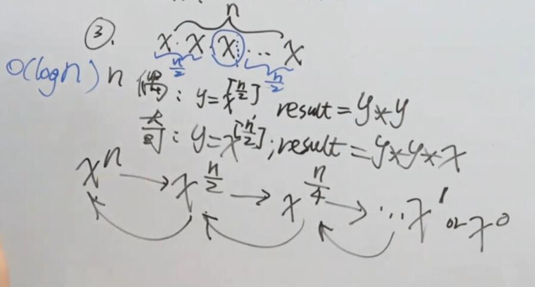

# 50-Pow(x, n)

## 实现 pow(x, n)，即计算 x 的 n 次幂函数。

示例 1:

```
输入: 2.00000, 10
输出: 1024.00000
```

示例 2:

```
输入: 2.10000, 3
输出: 9.26100
```

示例 3:

```
输入: 2.00000, -2
输出: 0.25000
解释: 2^-2 = 1/2^2 = 1/4 = 0.25
```

**说明:**

- -100.0 < *x* < 100.0
- *n* 是 32 位有符号整数，其数值范围是 [−2^31​, 2^31 − 1] 。


## 方法一：分治（递归）

### 时间复杂度：O(log n)

### 空间复杂度：O(log n)



```javascript
// 官方版1
var myPow = function (x, n) {
    function pow(x, n) {
        if (!n) return 1
        let y = pow(x, parseInt(n / 2))  // 注意n要为整数
        return n % 2 ? y * y * x : y * y
    }
    return n >= 0 ? pow(x, n) : 1 / pow(x, -n)
};

// 官方版2
var myPow = function (x, n) {
    function pow(x, n) {
        if (!n) return 1
        if (n % 2) return x * pow(x, n - 1)  // 此处n已做处理，保证为整数
        return pow(x * x, n / 2)
    }
    return n >= 0 ? pow(x, n) : 1 / pow(x, -n)
};

// 简化版
var myPow = function (x, n) {
    if (!n) return 1  // n=0直接返回1
    if (n == 1) return x
    if (n < 0) return 1 / myPow(x, -n)  //n<0时 x的n次方等于1除以x的-n次方分
    if (n % 2) return x * myPow(x, n - 1)  //n是奇数时 x的n次方 = x*x的n-1次方
    return myPow(x * x, n / 2)  //n是偶数，使用分治，一分为二，等于x*x的n/2次方
};
```


## 方法二：迭代（非递归）

### 时间复杂度：O(log n)

### 空间复杂度：O(1)

```javascript
// 常规版本
var myPow = function (x, n) {
    if (!n) return 1
    if (n == 1) return x
    if (n < 0) {
        x = 1 / x
        n = -n
    }
    let res = 1
    while (n) {
        if (n % 2) res *= x
        x *= x
        n = parseInt(n / 2) // 注意n要为整数
    }
    return res
};

// 利用位运算判断的版本
var myPow = function (x, n) {
    if (!n) return 1
    if (n < 0) {
        x = 1 / x
        n = -n
    }
    let res = 1
    while (n) {
        if (n & 1) res *= x  // & （二进制）逻辑与
        x *= x
        n >>>= 1  // >>> （二进制）无符号右移，即逻辑右移
    }
    return res
};
```


