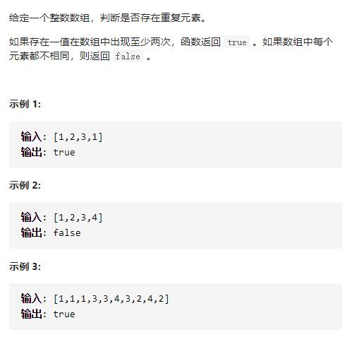

# 217-存在重复元素




## 方法1：哈希set

```js
var containsDuplicate = function (nums) {
    let set = new Set()
    for (let n of nums) {
        //如果有重复返回true
        if(set.has(n)) return true
        set.add(n)
    }
    return false
};
```

