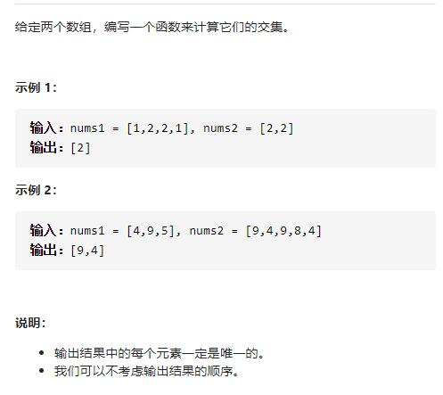

# 349-两个数组的交集




## 方法1：两个哈希set

**时间复杂度：O（n）**

1.将2个数组放入分别放入set中

2.遍历第二个set，判断当前元素在第一个set中是否存在，存在则加入到res结果数组中

```js
/**
 * @param {number[]} nums1
 * @param {number[]} nums2
 * @return {number[]}
 */
var intersection = function (nums1, nums2) {
    let res = []
    let set1 = new Set(nums1),
        set2 = new Set(nums2)
    for (let s of set2) {
        if (set1.has(s)) {
            res.push(s)
        }
    }
    return res
};
```


## 方法2：排序+双指针

**时间复杂度：O（n log n）** 即排序时间复杂度

**时间复杂度：O（log n）** 即排序空间复杂度

1.首先将数组排序

2.定义一个数组保存结果result

3.两个指针分别指向两个数组的头部

3.每次比较两个指针指向的两个数组中的数字，如果两个数字不相等，则将指向较小数字的指针右移一位。如果两个数字相等，且该数字不等于result的尾部元素，将元素放入结果数组，同时将两个指针都右移一位。当至少有一个指针超出数组范围时，遍历结束。

**注：** 解释下为啥与result的尾部元素比较，因为数组nums1，nums2是经过升序排序的，所以result也必然是升序的，所以新遍历的元素如果不等于result尾部元素，必然大于尾部元素，且不会与result内元素重复(因为是升序的)。

```js
/**
 * @param {number[]} nums1
 * @param {number[]} nums2
 * @return {number[]}
 */
var intersection = function (nums1, nums2) {
    nums1.sort((a, b) => a - b)
    nums2.sort((a, b) => a - b)
    let res = []
    let len1 = nums1.length,
        len2 = nums2.length
    let i1 = 0,
        i2 = 0
    while (i1 < len1 && i2 < len2) {
        if (nums1[i1] === nums2[i2]) {
            if (!res.length || nums1[i1] != res[res.length - 1]) {
                res.push(nums1[i1])
            }
            i1++
            i2++
        } else if (nums1[i1] > nums2[i2]) {
            i2++
        } else {
            i1++
        }
    }
    return res
};
```

