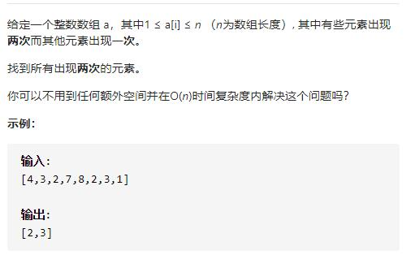

# 442-数组中重复的数据




## 方法1：哈希表-两次遍历

```js
/**
 * @param {number[]} nums
 * @return {number[]}
 */
var findDuplicates = function (nums) {
    if (!nums.length) return []
    let res = [],
        map = {}
    for (let num of nums) {
        if (map[num]) {
            map[num]++
        } else {
            map[num] = 1
        }
    }
    for (let k in map) {
        if (map[k] > 1) res.push(k)
    }
    return res
};
```


## 方法：取反标记法

借用索引号，因为是在1~n之间，那么我们可以用索引0表示数字1，索引1表示数字2...，当有个数字num，我们将num - 1的位置的数字取相反数，连续两次取相反数会变回来，便可判断元素出现次数。

```js
/**
 * @param {number[]} nums
 * @return {number[]}
 */
var findDuplicates = function (nums) {
    if (!nums.length) return []
    let res = []
    for (let i = 0; i < nums.length; i++) {
        let index = Math.abs(nums[i]) - 1
        if (nums[index] < 0) {
            res.push(index + 1)
        }
        nums[index] = -nums[index]
    }
    return res
};
```

