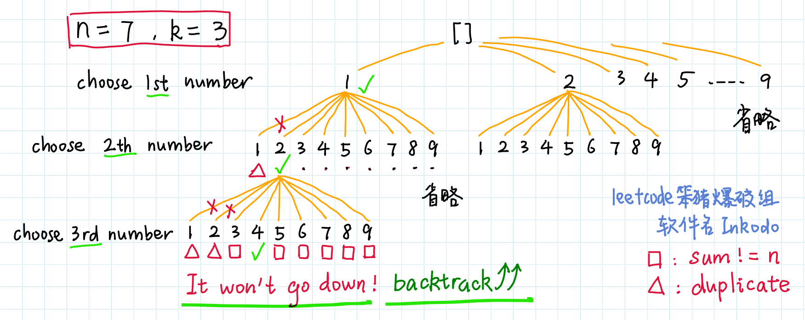
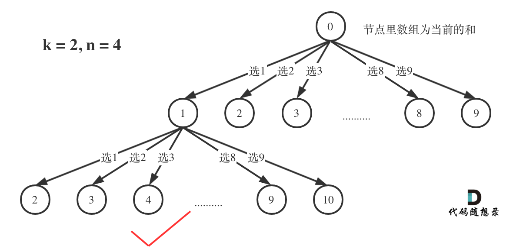

# 216-组合总和III

## 找出所有相加之和为 n 的 k 个数的组合。组合中只允许含有 1 - 9 的正整数，并且每种组合中不存在重复的数字。

## 说明：

### 所有数字都是正整数。

### 解集不能包含重复的组合。 

### 示例 1:

```
输入: k = 3, n = 7
输出: [[1,2,4]]
```

### 示例 2:

```
输入: k = 3, n = 9
输出: [[1,2,6], [1,3,5], [2,3,4]]
```


## 方法一：回溯 + 剪枝（加法）

### 递归树：





```javascript
var combinationSum3 = function (k, n) {
    let res = []
    // 一开始做一些特殊判断
    if (k <= 0 || n <= 0 || k > n) {
        return res;
    }
    function dfs(begin, sum, path) {
        if (path.length == k || sum >= n) {  // 剪枝,非必需
            if (path.length == k && sum == n) {
                res.push([...path])
            }
            return
        }
        // 注意这里，因为不能有重复的集合以及集合中不能有重复的数字，所以这里的i不能从0开始，
        // 要从上一个选择之后的下一个值开始
        for (let i = begin; i <= 9; i++) {
            path.push(i)
            dfs(i + 1, sum + i, path)
            path.pop()
        }
    }
    dfs(1, 0, [])
    return res
};
```


