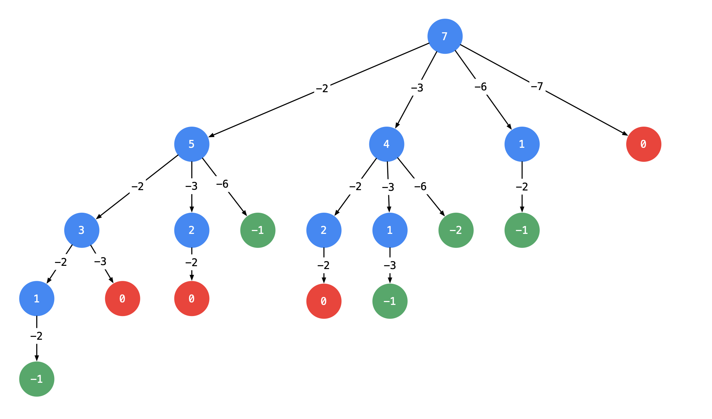

# 39-组合总和

### 给定一个无重复元素的正整数数组 candidates 和一个正整数 target ，找出 candidates 中所有可以使数字和为目标数 target 的唯一组合。

### candidates 中的数字可以无限制重复被选取。如果至少一个所选数字数量不同，则两种组合是唯一的。

#### 对于给定的输入，保证和为 target 的唯一组合数少于 150 个。

**示例 1：**

```
输入：candidates = [2,3,6,7], target = 7,
所求解集为：
[
  [7],
  [2,2,3]
]
```

**示例 2：**

```
输入：candidates = [2,3,5], target = 8,
所求解集为：
[
  [2,2,2,2],
  [2,3,3],
  [3,5]
]
```

**示例 3：**

```
输入: candidates = [2], target = 1
输出: []
```

**示例 4：**

```
输入: candidates = [1], target = 1
输出: [[1]]
```

**示例 5：**

```
输入: candidates = [1], target = 2
输出: [[1,1]]
```

**提示：**

- 1 <= candidates.length <= 30

- 1 <= candidates[i] <= 200

- candidate 中的每个元素都是独一无二的。

- 1 <= target <= 500


## 方法一：回溯 + 剪枝

### 1. 减法

### 递归树：



### 说明：

以 target = 7 为 根结点 ，创建一个分支的时 做减法 ；

每一个箭头表示：从父亲结点的数值减去边上的数值，得到孩子结点的数值。边的值就是题目中给出的 candidate 数组的每个元素的值；

减到 0 或者负数的时候停止，即：结点 0 和负数结点成为叶子结点；

所有从根结点到结点 0 的路径（只能从上往下，没有回路）就是题目要找的一个结果。

这棵树有 4 个叶子结点的值 0，对应的路径列表是 [[2, 2, 3], [2, 3, 2], [3, 2, 2], [7]]，而示例中给出的输出只有 [[7], [2, 2, 3]]。即：题目中要求每一个符合要求的解是 不计算顺序 的。下面我们分析为什么会产生重复。

### 结果集去重分析：

产生重复的原因是：在每一个结点，做减法，展开分支的时候，由于题目中说 每一个元素可以重复使用，我们考虑了 所有的 候选数，因此出现了重复的列表。

一种简单的去重方案是借助哈希表的天然去重的功能，但实际操作一下，就会发现并没有那么容易。

可不可以在搜索的时候就去重呢？答案是可以的。遇到这一类相同元素不计算顺序的问题，我们在搜索的时候就需要 按某种顺序搜索。具体的做法是：每一次搜索的时候设置 下一轮搜索的起点 begin，请看下图。


### 剪枝提速
根据上面画树形图的经验，如果 target 减去一个数得到负数，那么减去一个更大的树依然是负数，同样搜索不到结果。基于这个想法，我们可以对输入数组进行排序，添加相关逻辑达到进一步剪枝的目的；

排序是为了提高搜索速度，对于解决这个问题来说非必要。但是搜索问题一般复杂度较高，能剪枝就尽量剪枝。实际工作中如果遇到两种方案拿捏不准的情况，都试一下。


```javascript
var combinationSum = function (candidates, target) {
    if (!candidates.length) return []
    let res = []
    candidates.sort((a, b) => a - b)  //排序可减少递归次数，非必需
    function dfs(begin, target, path) {
        if (target < 0) return
        if (target == 0) {
            res.push([...path])
            return
        }
        // 这里i 依然从 startIndex开始，因为求的是组合，如果求的是排列，那么i每次都从0开始
        for (let i = begin; i < candidates.length; i++) {
            path.push(candidates[i])
            dfs(i, target - candidates[i], path)  // 注意：由于每一个元素可以重复使用，下一轮搜索的起点依然是 i，而不是i + 1
            path.pop(candidates[i])
        }
    }
    dfs(0, target, [])
    return res
};

//剪枝版
var combinationSum = function (candidates, target) {
    if (!candidates.length) return []
    let res = []
    candidates.sort((a, b) => a - b)  // 剪枝的前提，非必需
    function dfs(begin, target, path) {
        // 由于进入更深层的时候，小于 0 的部分被剪枝，因此递归终止条件值只判断等于 0 的情况
        if (target == 0) {
            res.push([...path])
            return
        }
        for (let i = begin; i < candidates.length; i++) {
            if (target - candidates[i] < 0) break  // 大剪枝
            path.push(candidates[i])
            dfs(i, target - candidates[i], path)
            path.pop(candidates[i])
        }
    }
    dfs(0, target, [])
    return res
};
```

### 2. 加法

#### 递归树：


如果是一个集合来求组合的话，就需要startIndex，如：组合，组合总和III

如果是多个集合取组合，各个集合之间相互不影响，那么就不用startIndex，如电话号码的字母组合

注意图中叶子节点的返回条件，因为本题没有组合数量要求，仅仅是总和的限制，所以递归没有层数的限制，sum等于target，即为所求；只要选取的元素总和sum大于target，就返回，即做剪枝！

不产生重复组合怎么限制（剪枝）？

如图，只要限制下一次选择的起点，是基于本次的选择，这样下一次就不会选到本次选择同层左边的数。即通过控制 for 遍历的起点，去掉会产生重复组合的选项。

注意，子递归传了 i 而不是 i+1 ，因为元素可以重复选入集合，如果传 i+1 就不重复了。

**注：** 与组合，组合总和III的区别：

- 元素可无限重复选取

- 组合无数量限制

```javascript
//基本与减法相同
var combinationSum = function (candidates, target) {
    if (!candidates.length) return []
    let res = []
    candidates.sort((a, b) => a - b)  //排序可减少递归次数，非必需
    // begin是当前选择的起点索引，path是当前的集合，sum是当前求和
    function dfs(begin, sum, path) {
        if (sum > target) return
        if (sum == target) {
            res.push([...path])
            return
        }
        // 枚举当前可选的数，从begin开始
        for (let i = begin; i < candidates.length; i++) {
            path.push(candidates[i])
            dfs(i, sum + candidates[i], path)
            path.pop(candidates[i])
        }
    }
    dfs(0, 0, [])
    return res
};
```

