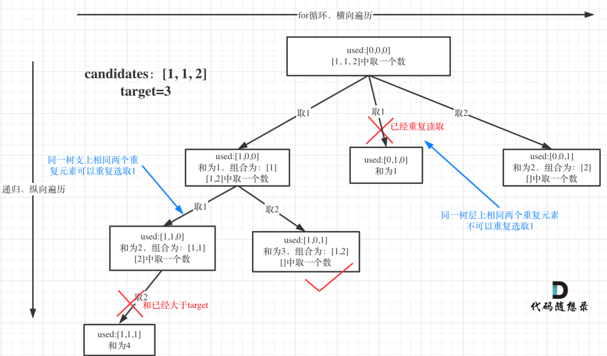

# 40-组合总和 II

给定一个数组 candidates 和一个目标数 target ，找出 candidates 中所有可以使数字和为 target 的组合。

candidates 中的**每个数字在每个组合中只能使用一次**。

**注意：** 解集不能包含重复的组合。 

**candidates 中有重复元素。**

**示例 1:**

```
输入: candidates = [10,1,2,7,6,1,5], target = 8,
输出:
[
[1,1,6],
[1,2,5],
[1,7],
[2,6]
]
```

**示例 2:**

```
输入: candidates = [2,5,2,1,2], target = 5,
输出:
[
[1,2,2],
[5]
]
```

**提示:**

- `1 <= candidates.length <= 100`
- `1 <= candidates[i] <= 50`
- `1 <= target <= 30`


## 方法1：回溯+剪枝




```js
/**
 * @param {number[]} candidates
 * @param {number} target
 * @return {number[][]}
 */
//普通单剪枝版
var combinationSum2 = function (candidates, target) {
    let res = []
    candidates.sort((a, b) => a - b)
    const dfs = (begin, target, path) => {
        if (target < 0) return
        if (target === 0) {
            res.push([...path])
            return
        }
        for (let i = begin; i < candidates.length; i++) {
            // 小剪枝：同一层相同数值的结点，从第 2 个开始，候选数更少，结果一定发生重复，因此跳过，用 continue
            if (i > begin && candidates[i] === candidates[i - 1]) continue
            path.push(candidates[i])
            dfs(i + 1, target - candidates[i], path)
            path.pop()
        }
    }
    dfs(0, target, [])
    return res
};

//双剪枝版
var combinationSum2 = function (candidates, target) {
    let res = []
    candidates.sort((a, b) => a - b)
    const dfs = (begin, target, path) => {
        if (target === 0) {
            res.push([...path])
            return
        }
        for (let i = begin; i < candidates.length; i++) {
            // 大剪枝：减去 candidates[i] 小于 0，减去后面的 candidates[i + 1]、candidates[i + 2] 肯定也小于 0，因此用 break
            if (target - candidates[i] < 0) break
            // 小剪枝：同一层相同数值的结点，从第 2 个开始，候选数更少，结果一定发生重复，因此跳过，用 continue
            if (i > begin && candidates[i] === candidates[i - 1]) continue
            path.push(candidates[i])
            dfs(i + 1, target - candidates[i], path)
            path.pop()
        }
    }
    dfs(0, target, [])
    return res
};
```

