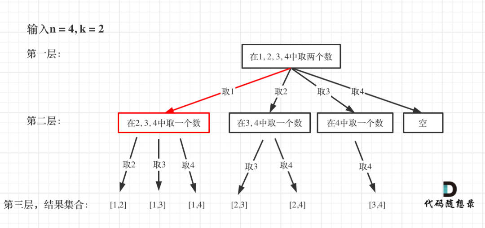

# 77-组合

### 给定两个整数 n 和 k，返回 1 ... n 中所有可能的 k 个数的组合。

### 你可以按 任何顺序 返回答案。

**示例:**

```
输入: n = 4, k = 2
输出:
[
  [2,4],
  [3,4],
  [2,3],
  [1,2],
  [1,3],
  [1,4]
]
```

**示例 2：**

```
输入：n = 1, k = 1
输出：[[1]]
```

**提示：**

- `1 <= n <= 20`
- `1 <= k <= n`


## 方法一：回溯1 - 根据搜索起点画出多叉树

**「每次从集合中选取元素，可选择的范围随着选择的进行而收缩，调整可选择的范围，就是要靠startIndex」**。

从下图中红线部分可以看出，在集合[1,2,3,4]取1之后，下一层递归，就要在[2,3,4]中取数了，那么下一层递归如何知道从[2,3,4]中取数呢，靠的就是startIndex。



```javascript
var combine = function (n, k) {
    if (k <= 0 || n < k) return []
    let res = []
    const dfs = (index, path) => {
        if (path.length == k) {
            res.push([...path])
            return
        }
        for (let i = index; i <= n; i++) {
            path.push(i)
            dfs(i + 1, path)
            path.pop()
        }
    }
    dfs(1, [])
    return res
};
```


## 方法二：回溯1 + 剪枝


图中每一个节点（图中为矩形），就代表本层的一个for循环，那么每一层的for循环从第二个数开始遍历的话，都没有意义，都是无效遍历。

**「所以，可以剪枝的地方就在递归中每一层的for循环所选择的起始位置」**。

**「如果for循环选择的起始位置之后的元素个数 已经不足 我们需要的元素个数了，那么就没有必要搜索了」**。

注意代码中i，就是for循环里选择的起始位置。

```
for (int i = startIndex; i <= n; i++) { 
```

接下来看一下优化过程如下：

1. 已经选择的元素个数：path.size();
2. 还需要的元素个数为: k - path.size();
3. 在集合n中至多要从该起始位置 : n - (k - path.size()) + 1，开始遍历

为什么有个+1呢，因为包括起始位置，我们要是一个左闭的集合。

举个例子，n = 4，k = 3， 目前已经选取的元素为0（path.size为0），n - (k - 0) + 1 即 4 - ( 3 - 0) + 1 = 2。

从2开始搜索都是合理的，可以是组合[2, 3, 4]。

这里大家想不懂的话，建议也举一个例子，就知道是不是要+1了。

所以优化之后的for循环是：

```
for (int i = startIndex; i <= n - (k - path.size()) + 1; i++) // i为本次搜索的起始位置
```

**完整代码：**

```javascript
var combine = function (n, k) {
    if (k <= 0 || n < k) return []
    let res = []
    const dfs = (index, path) => {
        if (path.length == k) {
            res.push([...path])
            return
        }
        // 剪枝  n - 还需要选的个数 + 1 = 搜素起点的上界
        for (let i = index; i <= n - (k - path.length) + 1; i++) {  
            path.push(i)
            dfs(i + 1, path)
            path.pop()
        }
    }
    dfs(1, [])
    return res
};
```


## 方法三：回溯2 + 剪枝 - 根据每一个数选与不选画出二叉树


```javascript
var combine = function (n, k) {
    if (k <= 0 || n < k) return []
    let res = []
    const dfs = (index, path) => {
        if (path.length == k) {
            res.push([...path])
            return
        }
        // 剪枝  n - 还需要选的个数 + 1 = 搜素起点的上界
        if (index > n - (k - path.length) + 1) return  
        path.push(index)  // 选
        dfs(index + 1, path)
        path.pop()
        dfs(index + 1, path) // 不选
    }
    dfs(1, [])
    return res
};
```


