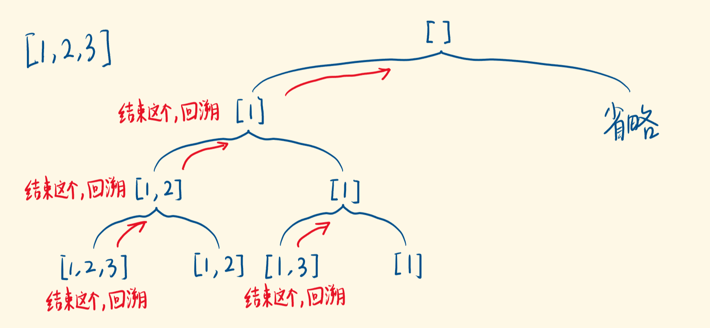
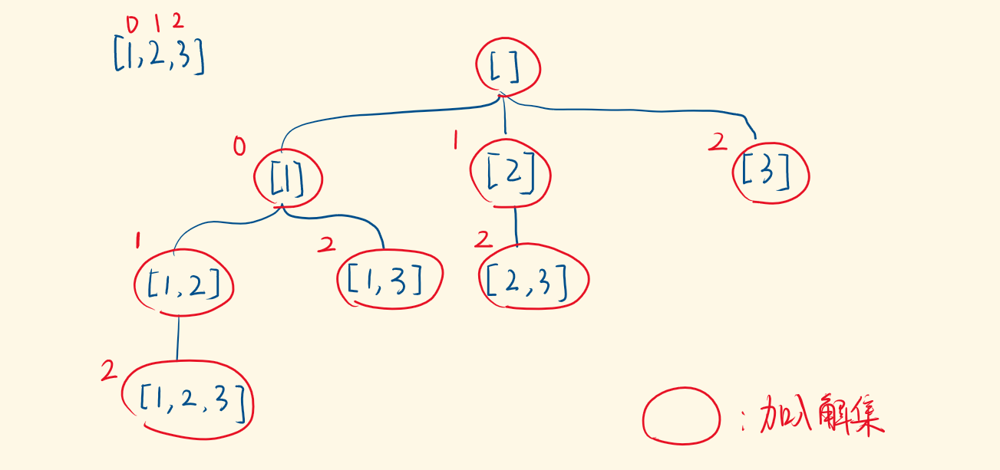
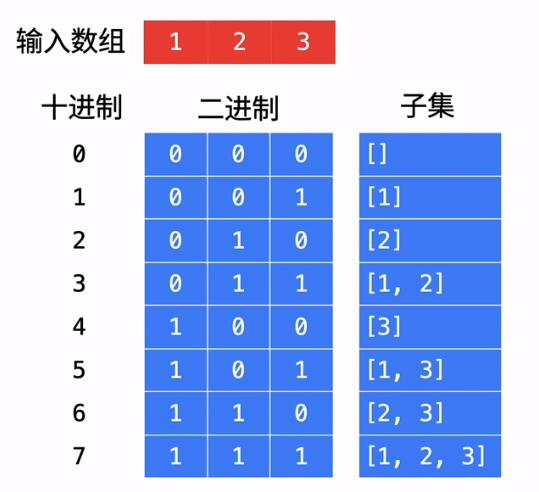

# 78-子集

### 给你一个整数数组 `nums` ，数组中的元素 **互不相同** 。返回该数组所有可能的子集（幂集）。

### 解集 **不能** 包含重复的子集。你可以按 **任意顺序** 返回解集。

**示例1:**

```
输入: nums = [1,2,3]
输出:
[
  [3],
  [1],
  [2],
  [1,2,3],
  [1,3],
  [2,3],
  [1,2],
  []
]
```

**示例 2：**

```
输入：nums = [0]
输出：[[],[0]]
```

**提示：**

- `1 <= nums.length <= 10`
- `-10 <= nums[i] <= 10`
- `nums` 中的所有元素 **互不相同**


### 怎么样写回溯算法(从上而下，※代表难点，根据题目而变化)

#### ①画出递归树，找到状态变量(回溯函数的参数)，这一步非常重要※

#### ②根据题意，确立结束条件

#### ③找准选择列表(与函数参数相关),与第一步紧密关联※

#### ④判断是否需要剪枝

#### ⑤作出选择，递归调用，进入下一层

#### ⑥撤销选择


## 方法一：常规迭代

### 时间复杂度：O(n * 2^n)  一共 2^n 个状态，每种状态需要 O(n) (即push的时间) 的时间来构造子集。

### 空间复杂度：O(n)  不计算res数组，临时数组 temp 的空间代价是 O(n)

```javascript
var subsets = function (nums) {
    let res = [[]]
    for (let num in nums) {
        for (let r in res) {
            let temp = [...res[r]]
            // 或 let temp = res[r].slice()
            temp.push(nums[num])
            res.push(temp)
        }
    }
    return res
};
```


## 方法二：回溯（递归）- 根据每一个数选与不选画出二叉树

#### 时间复杂度：O(n * 2^n)  一共 2^n 个状态，每种状态需要 O(n) (即push的时间) 的时间来构造子集。

#### 空间复杂度：O(n)  不计算res数组  临时数组 list 的空间代价是 O(n)，递归时栈空间的代价为 O(n)。

### 思路：根据每一个数选与不选画出二叉树

- 单看每个元素，都有两种选择：选入子集，或不选入子集。

- 比如[1,2,3]，先看1，选1或不选1，都会再看2，选2或不选2，以此类推。

- 考察当前枚举的数，基于选它而继续，是一个递归分支；基于不选它而继续，又是一个分支。
- 用索引`index`代表当前递归考察的数字`nums[index]`。
- 当`index`越界时，说明所有数字考察完了，得到一个解，把它加入解集，结束当前递归分支。

### 递归树：


### 为什么要回溯？

- 因为不是找到一个子集就完事。

- 找到一个子集，结束递归，要撤销当前的选择，回到选择前的状态，做另一个选择——不选当前的数，基于不选，往下递归，继续生成子集。

- 回退到上一步，才能在包含解的空间树中把路走全，回溯出所有的解。



```javascript
var subsets = function (nums) {
    let res = []
    const dfs = (index, list) => {
        if (index == nums.length) { // 指针越界
            res.push([...list]) // 加入解集
            // 或 res.push(list.slice())
            return // 结束当前的递归
        }
        list.push(nums[index]) // 选择这个数
        dfs(index + 1, list) // 基于该选择，继续往下递归，考察下一个数
        list.pop() // 上面的递归结束，撤销该选择

        dfs(index + 1, list) // 不选这个数，继续往下递归，考察下一个数
    }
    dfs(0, [])
    return res
};
```


## 方法三：回溯2（递归）- 根据搜索起点画出多叉树

#### 时间复杂度：O(n * 2^n)  一共 2^n 个状态，每种状态需要 O(n) (即push的时间) 的时间来构造子集。

#### 空间复杂度：O(n)  不计算res数组，临时数组 list 的空间代价是 O(n)，递归时栈空间的代价为 O(n)。

### 思路：根据搜索起点画出多叉树

#### 在执行子递归之前，加入解集，即，在递归压栈前 “做事情”。

#### 用 for 枚举出当前可选的数，比如选第一个数时：1、2、3 可选。

- 如果第一个数选 1，选第二个数，2、3 可选；

- 如果第一个数选 2，选第二个数，只有 3 可选（不能选1，产生重复组合）

- 如果第一个数选 3，没有第二个数可选

每次传入子递归的 index 是：当前你选的数的索引+1当前你选的数的索引+1。

每次递归枚举的选项变少，一直递归到没有可选的数字，那就进入不了for循环，落入不了递归，整个DFS结束。

可见我们没有显式地设置递归的出口，而是通过控制循环的起点，使得最后递归自然结束。

#### 递归树：



```javascript
var subsets = function (nums) {
    let res = []
    const dfs = (index, list) => {
        // 由于路径上所有的结果都是子集，因此直接添加即可;此处为前序遍历
        // 调用子递归前，加入解集
        res.push([...list])
        // 枚举出所有可选的数
        for (let i = index; i < nums.length; i++) {
            list.push(nums[i]) // 选这个数
            dfs(i + 1, list) // 基于选这个数，继续递归，传入的是i+1，不是index+1
            list.pop() // 撤销选这个数
        }
    }
    dfs(0, [])
    return res
};
```


### 回溯算法的模板！

```
1、路径：也就是已经做出的选择。
2、选择列表：也就是你当前可以做的选择。
3、结束条件：也就是到达决策树底层，无法再做选择的条件。

result = []
def backtrack(路径, 选择列表):
    if 满足结束条件:
        result.add(路径)
        return

    for 选择 in 选择列表:
        做选择
        backtrack(路径, 选择列表)
        撤销选择

```

### 回溯总结

#### 回溯算法就是个多叉树的遍历问题，关键就是在前序遍历和后序遍历的位置做一些操作，算法框架如下：

```
def backtrack(...):
  for 选择 in 选择列表:
    做选择
    backtrack(...)
    撤销选择
```

### 写backtrack函数时，需要维护走过的「路径」和当前可以做的「选择列表」，当触发「结束条件」时，将「路径」记入结果集。


## 方法四：位运算（了解！）

#### 时间复杂度：O(n * 2^n)  一共 2^n 个状态，每种状态需要 O(n) (即push的时间) 的时间来构造子集。

#### 空间复杂度：O(n)  不计算res数组，临时数组 list 的空间代价是 O(n)，递归时栈空间的代价为 O(n)。

### 图解：（画图模拟理解！）



```javascript
var subsets = function (nums) {
    let res = []
    let n = nums.length;
    let size = 1 << n;  // 左移n位，即2的n次方。即子集的总数
    // 遍历从0到size中间的所有数字，根据数字中1的位置来找子集
    for (let i = 0; i < size; i++) {
        let subset = []
        for (let j = 0; j < n; j++) {
            //如果数字i的某一个位置是1，就把数组中对应的数字添加到集合
            if ((i >> j) & 1 == 1) {  // 画图模拟理解！
            // 或 if ((i & (1 << j)) != 0) {
                subset.push(nums[j])
            }
        }
        res.push(subset)
    }
    return res
};
```


