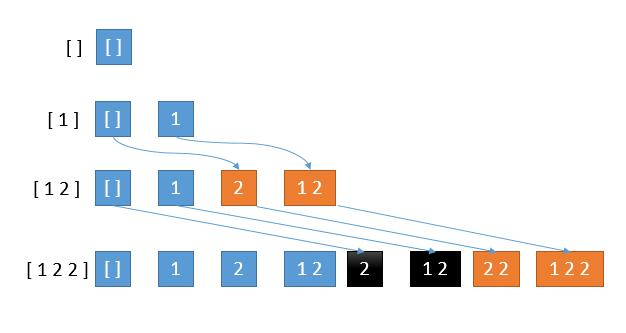
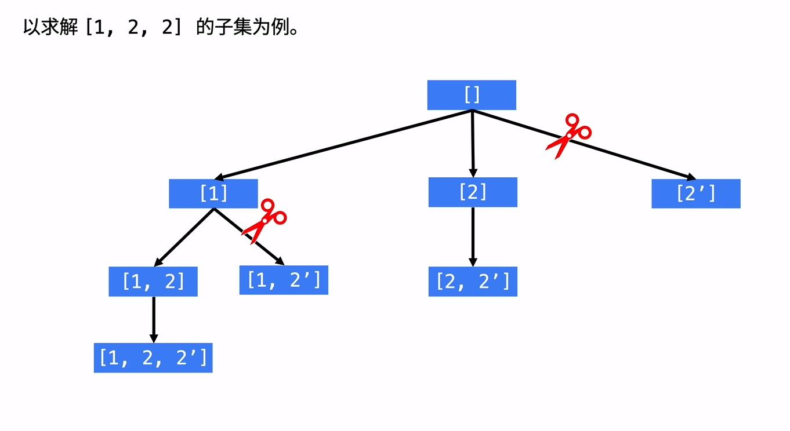
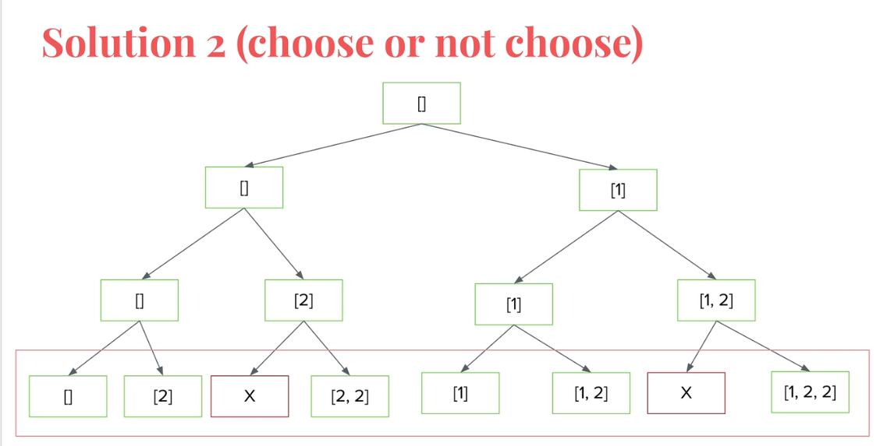

# 90-子集II

### 给你一个整数数组 nums ，其中可能包含重复元素，请你返回该数组所有可能的子集（幂集）。

### 解集 不能 包含重复的子集。返回的解集中，子集可以按 任意顺序 排列。

**示例 1：**

```
输入：nums = [1,2,2]
输出：[[],[1],[1,2],[1,2,2],[2],[2,2]]
```

**示例 2：**

```
输入：nums = [0]
输出：[[],[0]]
```

**提示：**

- `1 <= nums.length <= 10`
- `-10 <= nums[i] <= 10`


## 方法一：迭代法 + 哈希set / 新子集开始的位置

### 时间复杂度：O(n * 2^n)  一共 2^n 个状态，每种状态需要 O(n) (即push的时间) 的时间来构造子集。

### 空间复杂度：O(n)  不计算res数组，临时数组 temp 的空间代价是 O(n)

### 图解：



### 我们看到第 4 行黑色的部分，重复了，是怎么造成的呢？

### 第 4 行新添加的 2 要加到第 3 行的所有解中，而第 3 行的一部分解是旧解，一部分是新解。可以看到，我们黑色部分是由第 3 行的旧解产生的，橙色部分是由新解产生的。

### 而第 1 行到第 2 行，已经在旧解中加入了 2 产生了第 2 行的橙色部分，所以这里如果再在旧解中加 2 产生黑色部分就造成了重复。

### 所以当有重复数字的时候，我们只考虑上一步的新解，算法中用一个指针保存每一步的新解开始的位置即可。

```javascript
var subsetsWithDup = function (nums) {
    if (!nums.length) return []
    let res = [[]]
    let start = 0
    nums.sort((a, b) => a - b)  // 排序（升序或者降序都可以），为了便于剪枝，使相同的元素相邻
    for (let i = 0; i < nums.length; i++) {
        let res_len = res.length
        for (let j = 0; j < res_len; j++) {
            if (i > 0 && nums[i] == nums[i - 1] && j < start) continue  // 过滤掉上一次已经重复输出过子集 的情况
            res.push([...res[j], nums[i]])
        }
        // 存储上一个子集的数量
        start = res_len
    }
    return res
};

// 写法2
var subsetsWithDup = function (nums) {
    if (!nums.length) return []
    let res = [[]]
    let start = 0
    nums.sort((a, b) => a - b)  // 排序（升序或者降序都可以），为了便于剪枝，使相同的元素相邻
    for (let i = 0; i < nums.length; i++) {
        let res_temp = []
        let res_len = res.length
        for (let j = 0; j < res_len; j++) {
            if (i > 0 && nums[i] == nums[i - 1] && j < start) continue  // 过滤掉上一次已经重复输出过子集 的情况
            res_temp.push([...res[j], nums[i]])
        }
        start = res_len
        res.push(...res_temp)
    }
    return res
};
```


## 方法二：回溯 + 剪枝

#### 时间复杂度：O(n * 2^n)  一共 2^n 个状态，每种状态需要 O(n) (即push的时间) 的时间来构造子集。

#### 空间复杂度：O(n)  不计算res数组，临时数组 list 的空间代价是 O(n)，递归时栈空间的代价为 O(n)。

### 排序 + 剪枝

### 递归树：



```javascript
var subsetsWithDup = function (nums) {
    if (!nums.length) return []
    let res = []
    nums.sort((a, b) => a - b)  // 排序（升序或者降序都可以），为了便于剪枝，使相同的元素相邻
    const dfs = (index, path) => {
        res.push([...path])
        for (let i = index; i < nums.length; i++) {
            // 剪枝条件不能写i > 0，会剪去正常的结果
            if (i > index && nums[i] == nums[i - 1]) continue
            path.push(nums[i])
            dfs(i + 1, path)
            path.pop()
        }
    }
    dfs(0, [])
    return res
};
```


## 方法三：回溯2 + 剪枝

#### 时间复杂度：O(n * 2^n)  一共 2^n 个状态，每种状态需要 O(n) (即push的时间) 的时间来构造子集。

#### 空间复杂度：O(n)  不计算res数组  临时数组 list 的空间代价是 O(n)，递归时栈空间的代价为 O(n)。

### 排序 + 剪枝

### 递归树：



```javascript
var subsetsWithDup = function (nums) {
    let res = []
    nums.sort((a, b) => a - b)  // 排序（升序或者降序都可以），为了便于剪枝，使相同的元素相邻
    const dfs = (index, path) => {
        if (index == nums.length) {
            res.push([...path])
            // 或 res.push(path.slice())
            return
        }
        path.push(nums[index])
        dfs(index + 1, path)
        path.pop()
        if (path.length > 0 && path[path.length - 1] == nums[index]) return
        dfs(index + 1, path)
    }
    dfs(0, [])
    return res
};
```