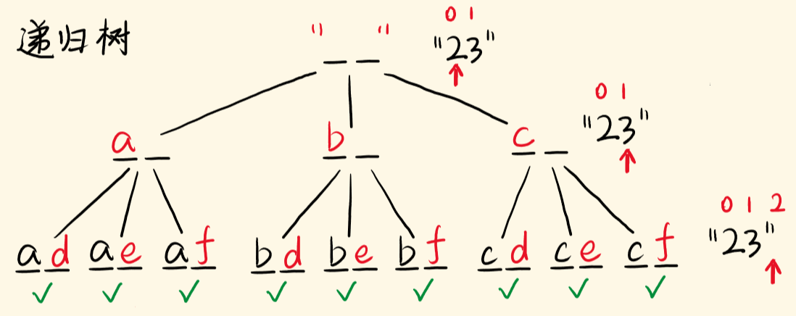

# 17-电话号码的字母组合

### 给定一个仅包含数字 2-9 的字符串，返回所有它能表示的字母组合。

### 答案可以按 任意顺序 返回。

### 给出数字到字母的映射如下（与电话按键相同）。注意 1 不对应任何字母。


**示例1：**

```
输入："23"
输出：["ad", "ae", "af", "bd", "be", "bf", "cd", "ce", "cf"].
```

**示例 2：**

```
输入：digits = ""
输出：[]
```

**示例 3：**

```
输入：digits = "2"
输出：["a","b","c"]
```

**提示：**

- `0 <= digits.length <= 4`
- `digits[i]` 是范围 `['2', '9']` 的一个数字。


## 方法一：回溯（DFS）- 类似全排列

#### 时间复杂度：O(4^n)

#### 空间复杂度：O(n)  不计算res数组

其实就是将数字串“翻译”成字母串，找出所有的翻译可能。

翻译第一个数字有 3 / 4 种选择，翻译第二个数字又有 3 / 4 种选择……

从首位翻译到末位，会展开成一棵递归树。指针 i 是当前考察的字符的索引。

当指针越界时，此时生成了一个解，加入解集，结束当前递归，去别的分支，找齐所有的解。



```javascript
var letterCombinations = function (digits) {
    if (!digits.length) return []
    let phoneMap = {
        2: "abc",
        3: "def",
        4: "ghi",
        5: "jkl",
        6: "mno",
        7: "pqrs",
        8: "tuv",
        9: "wxyz"
    }
    let res = []
    //当前构建的字符串为str，现在“翻译”到第i个数字，基于此继续“翻译”
    function dfs(index, str) {
        // 指针越界，递归的出口
        if (index === digits.length) {
            res.push(str)
            return
        }
        const s = phoneMap[digits[index]]; // 当前数字对应的字母
        for (let c of s) { // 一个字母是一个选择，对应一个递归分支
            dfs(index + 1, str + c)
        }
    }
    dfs(0, "")
    return res
};
```


## 方法2：BFS (了解！)

维护一个队列。起初让空字符串入列，让当前层的字符串逐个出列，出列的字符串，会构建它下一层的新字母串，并入列。

一层层地，考察到数字串的最末位，就到了最底一层，此时队列中存的是所有构建完毕的字母串，返回 queue 即可。

这里控制了层序遍历的深度，为 digits 的长度，而不是while(queue.length){...}那样让所有的节点入列出列，最后还会剩下最后一层节点，留在 queue 中返回。


```js
const letterCombinations = (digits) => {
  if (digits.length == 0) return [];
  const map = { '2': 'abc', '3': 'def', '4': 'ghi', '5': 'jkl', '6': 'mno', '7': 'pqrs', '8': 'tuv', '9': 'wxyz' };

  const queue = [];
  queue.push('');
  for (let i = 0; i < digits.length; i++) { // bfs的层数，即digits的长度
    const levelSize = queue.length;         // 当前层的节点个数
    for (let j = 0; j < levelSize; j++) {   // 逐个让当前层的节点出列
      const curStr = queue.shift();         // 出列

      const letters = map[digits[i]];       

      for (const l of letters) {
        queue.push(curStr + l); // 生成新的字母串入列
      }
    }
  }
  return queue; // 队列中全是最后一层生成的字母串
};
```

