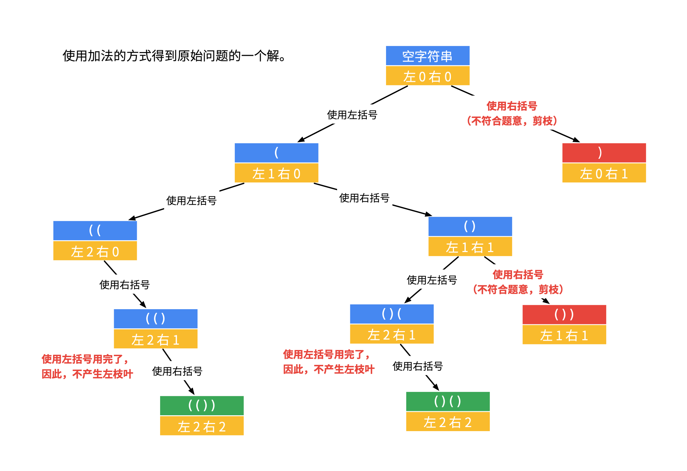

# 22-括号生成

### 数字 *n* 代表生成括号的对数，请你设计一个函数，用于能够生成所有可能的并且 **有效的** 括号组合。

**示例1：**

```
输入：n = 3
输出：[
       "((()))",
       "(()())",
       "(())()",
       "()(())",
       "()()()"
     ]
```

**示例 2：**

```
输入：n = 1
输出：["()"]
```

**提示：**

- `1 <= n <= 8`


### 画图理解！！！

## 方法一：回溯 （DFS + 剪枝）

### 由于字符串的特殊性，产生一次拼接都生成新的对象，因此无需状态重置的操作（即状态变量已复制，不是使用同一个状态变量了）！

### 1.减法

#### 当前左右括号都有大于 0 个可以使用的时候，才产生分支；

#### 产生左分支的时候，只看当前是否还有左括号可以使用；

#### 产生右分支的时候，还受到左分支的限制，右边剩余可以使用的括号数量一定得在严格大于左边剩余的数量的时候，才可以产生分支；

#### 在左边和右边剩余的括号数都等于 0 的时候结算。


#### 扩展：

就是不停选括号啊~，要么选左括号，要么选右括号。

并且，是有约束的：

只要(有剩，就可以选(。 (((((这么选，都还不能判定为非法。

当剩下的)比(多时，才可以选)，否则，)不能选，选了就非法了（见下图）。

描述节点的状态有：当前构建的字符串，和左右括号所剩的数量。


```javascript
var generateParenthesis = function (n) {
    if (n == 0) return [];
    let res = [];
    function generate(left, right, str) {
        if (left == 0 && right == 0) {
            res.push(str);
            return;
        }
        // 剪枝（左括号可以使用的个数严格大于右括号可以使用的个数，才剪枝，注意这个细节）
        if (left > right) return;
        // 产生左括号的时候，只看当前是否还有左括号可以使用;
        if (left > 0) generate(left - 1, right, str + "(");
        // 产生右括号的时候，还受到左括号的限制，右括号剩余数量一定得严格大于左括号剩余数量，才可产生右括号;
        if (left < right) generate(left, right - 1, str + ")");
    }
    generate(n, n, "");
    return res;
};
```


### 2.加法



```javascript
var generateParenthesis = function (n) {
    if (n == 0) return [];
    let res = [];
    function generate(left, right, str) {
        if (left === n && right === n) {
        	res.push(str);
            return;
        }
        // 剪枝（右括号使用的个数严格大于左括号使用的个数，才剪枝，注意这个细节）
        if (left < right) return;
        // 产生左括号的时候，只看当前是否还有左括号可以使用;
        if (left < n) generate(left + 1, right, str + "(");
        // 产生右括号的时候，还受到左括号的限制，左括号当前数量一定得严格大于右括号当前数量，才可产生右括号;
        if (left > right) generate(left, right + 1, str + ")");
    }
    generate(0, 0, "");
    return res;
};
```

