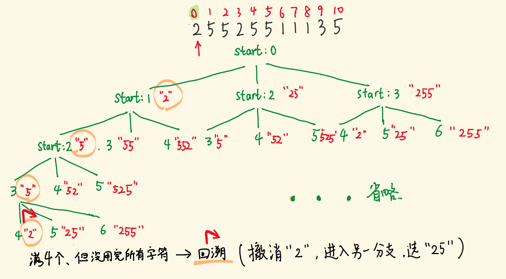
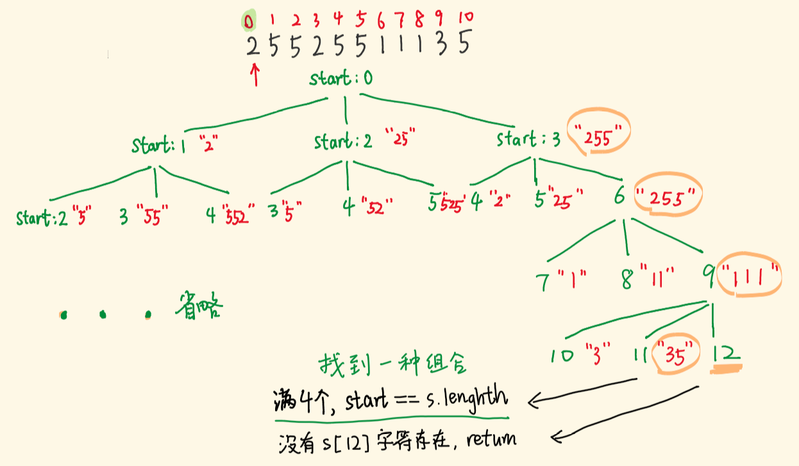

# 93-复原 IP 地址

### 给定一个只包含数字的字符串，用以表示一个 IP 地址，返回所有可能从 s 获得的 有效 IP 地址 。你可以按任何顺序返回答案。

### 有效 IP 地址 正好由四个整数（每个整数位于 0 到 255 之间组成，且不能含有前导 0），整数之间用 '.' 分隔。

#### 例如："0.1.2.201" 和 "192.168.1.1" 是 有效 IP 地址，但是 "0.011.255.245"、"192.168.1.312" 和 "192.168@1.1" 是 无效 IP 地址。

**示例 1：**

```
输入：s = "25525511135"
输出：["255.255.11.135","255.255.111.35"]
```

**示例 2：**

```
输入：s = "0000"
输出：["0.0.0.0"]
```

**示例 3：**

```
输入：s = "1111"
输出：["1.1.1.1"]
```

**示例 4：**

```
输入：s = "010010"
输出：["0.10.0.10","0.100.1.0"]
```

**示例 5：**

```
输入：s = "101023"
输出：["1.0.10.23","1.0.102.3","10.1.0.23","10.10.2.3","101.0.2.3"]
```

**提示：**

- `0 <= s.length <= 3000`
- `s` 仅由数字组成


## 方法1：回溯 + 剪枝

#### 前提：如果长度不够，不搜索，即ip长度在4-12之间

### 0.递归函数参数

- 选择切出一个片段后，继续递归剩余子串。传指针，加上当前的片段数组，描述节点的状态。

### 1.终止条件：

- 生成 4 个有效片段，并且要耗尽 IP 的字符。当满足该条件时，说明生成了一个有效组合，加入解集，结束当前递归，继续探索别的分支。

### 2.约束条件

- 一个片段的长度是 1~3

- 片段的值范围是 0~255

- 不能有前导0，即 "0x"、"0xx" 形式

### 3.剪枝：

- 如果满4个有效片段，但没耗尽字符，不是想要的解，不继续往下递归，提前回溯。

### 4.选择（递归）逻辑

- 枚举出选择，三种切割长度
- 再进行约束条件控制，最后加入片段数组，递归到下一层，进行第二次选择



如图['2','5','5','2']未耗尽字符，不是有效组合，不继续选下去。撤销选择"2"，回到之前的状态（当前分支砍掉了），切入到另一个分支，选择"25"。

回溯会穷举所有节点，通常用于解决「找出所有可能的组合」问题。

下图展示找到一个有效的组合的样子。start 指针越界，代表耗尽了所有字符，且满 4 个片段。




```js
/**
 * @param {string} s
 * @return {string[]}
 */
var restoreIpAddresses = function (s) {
    // 如果长度不够，不搜索
    if (s.length < 4 || s.length > 12) return [];
    let res = []
    // 复原从start开始的子串
    const dfs = (start, strArr) => {
        // 片段满4段，且耗尽所有字符
        if (strArr.length === 4 && start === s.length) {
            res.push(strArr.join("."))
            return
        }
        // 满4段，字符未耗尽，不用往下选了
        if (strArr.length === 4 && start < s.length) return
        // 枚举出选择，三种切割长度
        for (let len = 1; len <= 3; len++) {
            //此处是下标注意-1
            //加上要切的长度就越界，不能切这个长度
            if (start + len - 1 >= s.length) return
            // 不能切出'0x'、'0xx'
            if (len != 1 && s[start] === "0") return
            // 当前选择切出的片段
            const str = s.slice(start, start + len)
            // 不能超过255
            if (len === 3 && str * 1 > 255) return
            // 作出选择，将片段加入strArr
            strArr.push(str)
            // 基于当前选择，继续选择，注意更新指针
            dfs(start + len, strArr)
            //撤销选择，即回溯
            strArr.pop()
        }
    }
    dfs(0, [])
    return res
};
```

