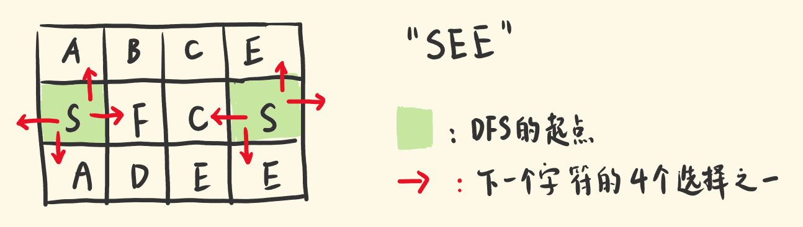
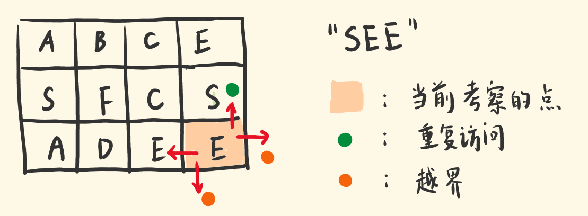

# 79-单词搜索

给定一个 m x n 二维字符网格 board 和一个字符串单词 word 。如果 word 存在于网格中，返回 true ；否则，返回 false 。

单词必须按照字母顺序，通过相邻的单元格内的字母构成，其中“相邻”单元格是那些水平相邻或垂直相邻的单元格。同一个单元格内的字母不允许被重复使用。

**示例 1：**


```
输入：board = [["A","B","C","E"],["S","F","C","S"],["A","D","E","E"]], word = "ABCCED"
输出：true
```

**示例 2：**


```
输入：board = [["A","B","C","E"],["S","F","C","S"],["A","D","E","E"]], word = "SEE"
输出：true
```

**示例 3：**


```
输入：board = [["A","B","C","E"],["S","F","C","S"],["A","D","E","E"]], word = "ABCB"
输出：false
```

**提示：**

- m == board.length

- n = board[i].length

- 1 <= m, n <= 6

- 1 <= word.length <= 15

- board 和 word 仅由大小写英文字母组成

**进阶：**你可以使用搜索剪枝的技术来优化解决方案，使其在 `board` 更大的情况下可以更快解决问题？


## 方法1：回溯

### 思路：

- 以"SEE"为例，首先要选对起点：遍历一遍矩阵，找到起点S。

- 起点可能不止一个，基于其中一个S，看看能否找出剩下的"EE"路径。

- 下一个字符E有四个可选点：当前点的上、下、左、右。

- 逐个尝试每一种选择。基于当前选择，为下一个字符选点，又有四种选择，继续探索。

- 每到一个点做的事情是一样的。DFS 往下选点，构建路径。

- 当发现某个选择不对，不用继续选下去了，结束当前递归，考察别的选择。



**递归把握什么？**

关注当前考察的点，处理它，其他丢给递归子调用去做。

- 判断当前选择的点，本身是不是一个错的点。

- 剩下的字符能否找到路径，交给递归子调用去做。

如果当前点是错的，不用往下递归了，返回false。否则继续递归四个方向，为剩下的字符选点。
那么，哪些情况说明这是一个错的点：

1.当前的点，越出矩阵边界。

2.当前的点，之前访问过，不满足「同一个单元格内的字母不允许被重复使用」。

3.当前的点，不是目标点，比如你想找 E，却来到了 D。



**记录访问过的点**

用一个二维矩阵 used，记录已经访问过的点，下次再选择访问这个点，就直接返回 false。

**为什么要回溯?**

有的选点是错的，选择它，构建不出目标路径，不能继续选。要撤销这个选择，去尝试别的选择。

```js
// canFindRest 表示：基于当前选择的点[row,col]，能否找到剩余字符的路径。
const findRes =
      canFind(row + 1, col, i + 1) ||
      canFind(row - 1, col, i + 1) ||
      canFind(row, col + 1, i + 1) ||
      canFind(row, col - 1, i + 1)
```

如果第一个递归调用返回 false，就会执行||后的下一个递归

- 这里暗含回溯：当前处在[row,col]，选择[row+1,col]继续递归，返回false的话，会撤销[row+1,col]这个选择，回到[row,col]，选择[row-1,col]继续递归。

只要其中有一个递归调用返回真，||后的递归就不会执行，即找到解就终止搜索，利用||的短路效应，把枝剪了。

如果求出 canFindRest 为 false，说明当前点是错的选择，不仅当前递归要返回false，还要在used矩阵中把当前点恢复为未访问，让它后续能正常被访问。

- 因为，基于当前路径，选当前点是不对的，但基于别的路径，走到这选它，有可能是对的。

**什么时候返回 true？**

在递归中，我们设置了所有返回 false 的情况。

当指针越界，此时已经考察完单词字符，意味着，在该递归分支中，为一个个字符选点，始终没有返回过 false，这些字符都选到对的点。所以指针越界就可以返回 true。

**完整代码：**

```js
/**
 * @param {character[][]} board
 * @param {string} word
 * @return {boolean}
 */
var exist = function (board, word) {
    let m = board.length,
        n = board[0].length
    let used = new Array(m) // 二维矩阵used，存放bool值是否访问过
    for (let i = 0; i < m; i++) {
        used[i] = new Array(n)
    }
    // canFind 判断当前点是否是目标路径上的点
    // row col 当前点的坐标，i当前考察的word字符索引
    const canFind = (row, col, i) => {
        // 递归的出口 i越界了就返回true
        if (i === word.length) return true
        // 当前点越界 返回false
        if (row < 0 || row >= m || col < 0 || col >= n) return false
        // 当前点已经访问过，或 非目标点
        if (used[row][col] || board[row][col] !== word[i]) return false
        // 排除掉所有false的情况，当前点暂时没毛病，可以继续递归考察
        // 记录一下当前点被访问了
        used[row][col] = true
        // findRes：基于当前选择的点[row,col]，能否找到剩余字符的路径。
        let findRes = canFind(row + 1, col, i + 1) || canFind(row - 1, col, i + 1)
            || canFind(row, col + 1, i + 1) || canFind(row, col - 1, i + 1)
        // 基于当前点[row,col]，可以为剩下的字符找到路径
        if (findRes) return true
        // 不能为剩下字符找到路径，返回false，撤销当前点的访问状态
        used[row][col] = false
        return false
    }
    //遍历二维字符网络，进行递归查找
    for (let i = 0; i < m; i++) {
        for (let j = 0; j < n; j++) {
            //判断是否找到目标路径
            if (canFind(i, j, 0)) {
                return true
            }
        }
    }
    // 怎么样都没有返回true，则返回false
    return false
};

//不使用used数组版本
//每走过一个节点就把那个节点改成null，然后函数结束之前再把值还原回去
var exist = function (board, word) {
    let m = board.length,
        n = board[0].length
    const canFind = (row, col, i) => {
        if (i === word.length) return true
        if (row < 0 || row >= m || col < 0 || col >= n) return false
        if (!board[row][col] || board[row][col] !== word[i]) return false
        let temp = board[row][col]
        board[row][col] = null
        let findRes = canFind(row + 1, col, i + 1) || canFind(row - 1, col, i + 1)
            || canFind(row, col + 1, i + 1) || canFind(row, col - 1, i + 1)
        if (findRes) {
            board[row][col] = temp
            return true
        }
        board[row][col] = temp
        return false
    }
    for (let i = 0; i < m; i++) {
        for (let j = 0; j < n; j++) {
            if (canFind(i, j, 0)) {
                console.log(board)
                return true
            }
        }
    }
    return false
};
```

