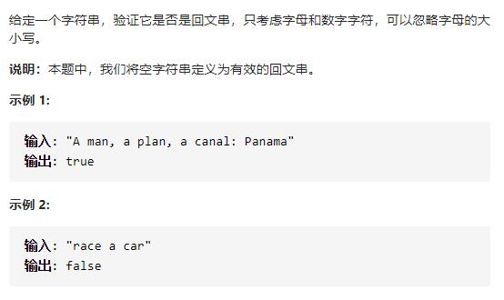

# 125-验证回文串




## 方法1：正则 + 双指针

```js
var isPalindrome = function (s) {
    //忽略大小写，并匹配字母和数字
    let res = s.toLowerCase().match(/[a-z0-9]+/g) //返回结果数组
    if (!res) return true; //空字符串算回文串
    let str = res.join(""); //转回字符串
    let l = 0,
        r = str.length - 1;
    //双指针夹逼比较
    while (l < r) {
        if (str[l] !== str[r]) return false;
        l++;
        r--;
    }
    return true;
};
```


