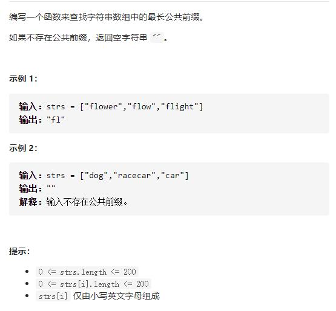

# 14-最长公共前缀




## 方法1：各字符串逐位扫描比较（竖向扫描）

```js
var longestCommonPrefix = function (strs) {
    if (strs.length === 0) return "" //特殊情况返回""
    if (strs.length === 1) return strs[0] //只有一个返回第一个
    // let res = ""
    // for (let i = 0; i < strs[0].length; i++) {
    //     for (let j = 1; j < strs.length; j++) {
    //         //如果带比较的字符串到头了，或当前位与第一个的字符不等
    //         if (i === strs[j].length || strs[0][i] != strs[j][i]) return res
    //     }
    //     res += strs[0][i]
    // }
    // return res

    //写法2
    for (let i = 0; i < strs[0].length; i++) {
        for (let j = 1; j < strs.length; j++) {
            if (i === strs[j].length || strs[0][i] != strs[j][i]) {
                return strs[0].slice(0, i)
            }
        }
    }
    return strs[0]
};
```


