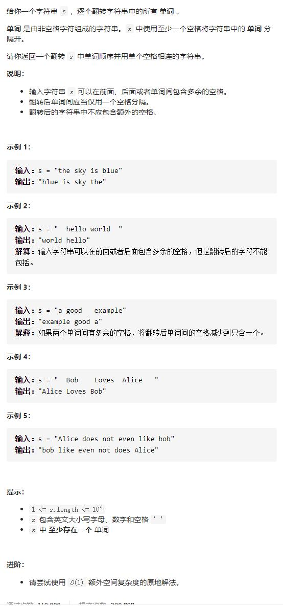

# 151-翻转字符串里的单词




## 方法1：正则+split+reverse+join

- 先去开头空格和多余的空格，再反转

```js
var reverseWords = function(s) {
	return s.trim().replace(/\s+/g, " ").split(" ").reverse().join(" ");
    //return s.trim().split(/\s+/).reverse().join(" ");
};
```


## 方法2：双端队列/栈，再转换为字符串

- 时间复杂度：O(N)，其中 N 为输入字符串的长度。
- 空间复杂度：O(N)，双端队列存储单词需要 O(N) 的空间。

```js
var reverseWords = function (s) {
    let l = 0,
        r = s.length - 1;
    let queue = []; //双端队列与栈
    let word = ""; //保存单词
    //去除两端空格
    while (l < r && s[l] === " ") l++
    while (l < r && s[r] === " ") r--
    while (l <= r) {
        //判断是否是到单词分隔处，且有单词
        if (word.length && s[l] === " ") {
            queue.unshift(word)
            word = ""
        } if (s[l] !== " ") {
            word += s[l]
        }
        l++
    }
    //加入最后一个word，因为没有" "了
    queue.unshift(word)
    return queue.join(" ");
};
```


## 方法3：双指针

```js
```

