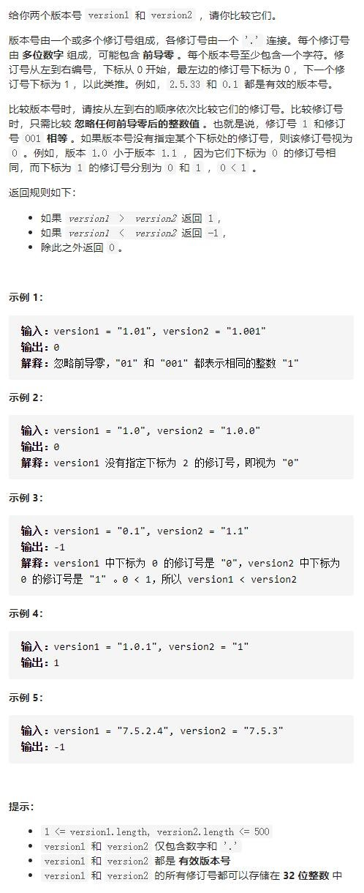

# 165-比较版本号




## 方法1：api分割字符+常规单指针+线性空间

时间复杂度：O(n)

空间复杂度：O(n)

```js
//1.分割+解析，线性空间
var compareVersion = function (version1, version2) {
    //分别将2个版本号按.拆分为数组
    let v1 = version1.split(".")
    let v2 = version2.split(".")
    //取较大的版本长度作为遍历次数
    let n = Math.max(v1.length, v2.length)
    for (let i = 0; i < n; i++) {
        //如果某个版本遍历完为undefined，则补0。有内容则使用parseInt转为数字并去前导0
        c1 = v1[i] ? parseInt(v1[i]) : 0
        c2 = v2[i] ? parseInt(v2[i]) : 0
        //比较版本号的大小
        if (c1 > c2) {
            return 1
        } else if (c1 < c2) {
            return -1
        }
    }
    return 0
};
```


## 方法2：双指针+自己分割字符+常数空间

时间复杂度：O(n)

空间复杂度：O(1)

```js
//2.双指针，常数空间
var compareVersion = function (version1, version2) {
    let n1 = version1.length,
        n2 = version2.length
    let i1 = 0, i2 = 0 //定义双指针
    while (i1 < n1 || i2 < n2) {
        //若为.则指针向后移动
        if (i1 < n1 && version1[i1] === '.') i1++
        if (i2 < n2 && version2[i2] === '.') i2++
        //提取.之间(各版本)的数字字符
        let s1 = "", s2 = ""
        while (i1 < n1 && version1[i1] !== '.') {
            s1 += version1[i1]
            i1++
        }
        while (i2 < n2 && version2[i2] !== '.') {
            s2 += version2[i2]
            i2++
        }
        //转换为数字，再比较，到头的版本号补0
        let c1 = s1 ? parseInt(s1) : 0
        let c2 = s2 ? parseInt(s2) : 0
        //比较版本号的大小
        if (c1 > c2) {
            return 1
        } else if (c1 < c2) {
            return -1
        }
    }
    return 0
};
```

