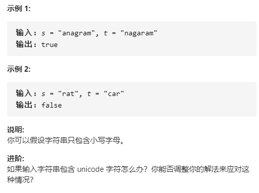

# 242-有效的字母异位词 (两个字符串包含的字符是否完全相同)

## 给定两个字符串 *s* 和 *t* ，编写一个函数来判断 *t* 是否是 *s* 的字母异位词。




## 方法一：排序法（暴力法）

### 时间复杂度：O(nlogn)

### 空间复杂度：O(1)

### 通过将 s 的字母重新排列成 t 来生成变位词。因此，如果 T 是 S 的变位词，对两个字符串进行排序将产生两个相同的字符串。此外，如果 s 和 t 的长度不同，t 不能是 s 的变位词，我们可以提前返回。

### 1.先通过split将字符串转换为数组
### 2.再执行sort将数组进行排序

### 3.再把数组join转换为字符串

### 4.返回2个字符串的强对比(恒等)

```javascript
var isAnagram = function(s, t) {
    // 2个字符串长度不等，就不是异位词
    if(s.length != t.length) return false;
    return s.split("").sort().join("") === t.split("").sort().join("");
}
```


## 方法二：数组模拟哈希map 计数(Unicode)（适用于数据量小的情况）

### 时间复杂度：O(n)

### 空间复杂度：O(1)

### 首先判断两个字符串长度是否相等，不相等则直接返回 false

### 若相等，则初始化 26 个字母哈希数组，遍历字符串 s 和 t

### s 负责在对应位置增加，t 负责在对应位置减少

### 如果哈希表的值都为 0，则二者是字母异位词

```javascript
var isAnagram = function (s, t) {
    if (s.length != t.length) return false;
    let obj = new Array(26).fill(0);
    for (let i = 0; i < s.length; i++) {
        obj[s.charCodeAt(i) - 'a'.charCodeAt()]++;
        obj[t.charCodeAt(i) - 'a'.charCodeAt()]--;
    }
    for (let o of obj) {
        if (o != 0) return false;
    }
    return true;
}
```


## 方法三：用对象模拟哈希map 计数（适用于数据量大的情况）

### 时间复杂度：O(n)

### 空间复杂度：O(n)

### 维护一个哈希的对象，分别对其中一个单词每个字母出现的字符次数进行增加，对另一给单词每个字母出现的次数进行减少。最后遍历哈希数组只要有不为0的就是false。需要判断是否有这个key

```javascript
var isAnagram = function (s, t) {
    if (s.length != t.length) return false;
    let obj = {};
    for (let i = 0; i < s.length; i++) {
        if (!obj[s[i]]) obj[s[i]] = 0;
        obj[s[i]]++;
        if (!obj[t[i]]) obj[t[i]] = 0;
        obj[t[i]]--;
    }
    for (let n in obj) {
        if (obj[n] != 0) return false;
    }
    return true;
}
```


## 方法四：使用ES6 Map 结构 计数（适用于数据量大的情况）

### 时间复杂度：O(n)

### 空间复杂度：O(n)

### 原理与方法三类似，此处是真正哈希map

```javascript
var isAnagram = function (s, t) {
    if (s.length != t.length) return false;
    let obj = new Map();
    for (let i = 0; i < s.length; i++) {
        if (!obj.get(s[i])) obj.set(s[i], 0);
        obj.set(s[i], obj.get(s[i]) + 1);
        if (!obj.get(t[i])) obj.set(t[i], 0);
        obj.set(t[i], obj.get(t[i]) - 1);
    }
    for (let o of obj) {
        // 遍历map，o是一个数组，第一个元素是key，第二个是值
        if (o[1] != 0) return false;
    }
    return true;
}
```

