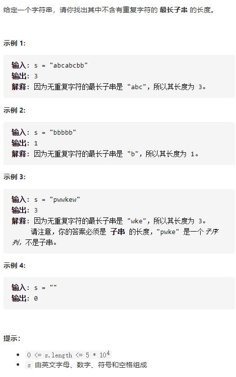
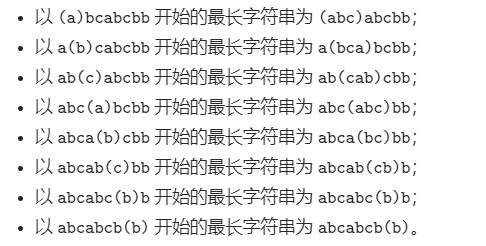

# 3-无重复字符的最长子串




## 方法1：滑动窗口 + 优化

优化前：O(N^2)

时间复杂度：O(N)

优化前：左指针挨个遍历



优化：

1. 用双指针维护一个滑动窗口，用来剪切子串
2. 不断移动右指针，遇到重复字符，就把左指针移动到重复字符的下一位
3. 过程中，记录所有窗口的长度，并返回最大值

```js
//1.滑动窗口
var lengthOfLongestSubstring = function (s) {
    let set = new Set()
    // 右指针，初始值为 -1，相当于我们在字符串的左边界的左侧，还没有开始移动
    let r = -1,
        res = 0
    for (let i = 0; i < s.length; i++) {
        if (i != 0) {
            // 左指针向右移动一格，移除一个字符
            set.delete(s[i - 1])
        }
        // 不断地移动右指针，直到出现重复元素
        while (r + 1 < s.length && !set.has(s[r + 1])) {
            set.add(s[r + 1])
            r++
        }
        // console.log(r - i + 1, set.size)
        // res = Math.max(res, r - i + 1)
        res = Math.max(res, set.size)
    }
    return res
};

//2.滑动窗口+优化
var lengthOfLongestSubstring = function (s) {
    let map = new Map()
    let l = 0, //左指针
        res = 0
    for (let r = 0; r < s.length; r++) {
        if (map.has(s[r])) {
            l = Math.max(l, map.get(s[r]) + 1) //左指针跳到先前保存的重复元素的后一个位置
        }
        map.set(s[r], r)
        res = Math.max(res, r - l + 1)
    }
    return res
};
```

