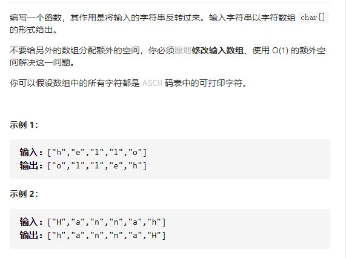

# 344-原地反转字符串




## 方法一：双指针夹逼

- 时间复杂度：O(N)，其中 N 为字符数组的长度。一共执行了 N/2 次的交换。

```js
var reverseString = function (s) {
    for (let l = 0, r = s.length - 1; l < r; l++, r--) {
        // let temp = s[l];
        // s[l] = s[r];
        // s[r] = temp;
        // 或 解构赋值简写
        [s[r], s[l]] = [s[l], s[r]];
    }
    return s
};
```


