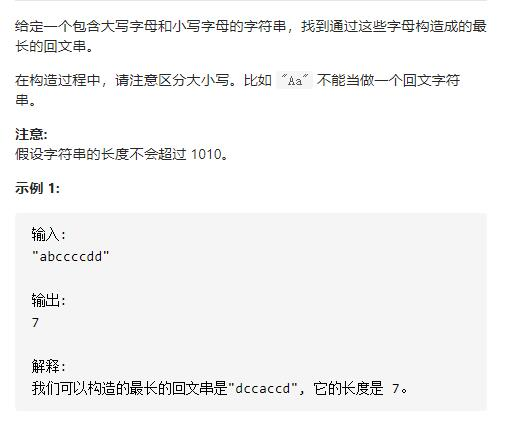

# 409-最长回文串




### 分析：

找出可以构成最长回文串的长度

奇数长度的回文串中，只有最多一个字符出现了奇数次，其余的字符都出现偶数次。

偶数长度回文串中，所有字符出现偶数次

## 方法1：哈希表-各字符可回文使用的个数+一个奇数个数字符（第一次遍历到）

```js
var longestPalindrome = function (s) {
    let map = new Map();
    //收集各字符的出现个数
    for (let str of s) {
        map.has(str) ? map.set(str, map.get(str) + 1) : map.set(str, 1);
    }
    let count = 0;
    for (let v of map.values()) {
        //各字符可回文使用的个数，count一直是偶数
        count += Math.floor(v / 2) * 2;
        //使用第一次奇数个数的字符作为回文中心，使count变成奇数，后续不在使用奇数个数的字符作为中心
        if (v % 2 == 1 && count % 2 == 0) {
            count++;
        }
    }
    return count;
};
```


## 方法2：哈希表-优化-只统计各字符可回文使用的个数（不管奇偶数个数字符），若回文长度小于字符串长度则说明有奇数个数的字符，长度再+1

```js
var longestPalindrome = function (s) {
    let map = new Map();
    //收集各字符的出现个数
    for (let str of s) {
        map.has(str) ? map.set(str, map.get(str) + 1) : map.set(str, 1);
    }
    let count = 0;
    //只统计各字符可回文使用的个数
    for (let v of map.values()) {
        //各字符可回文使用的个数
        count += Math.floor(v / 2) * 2;
    }
    //如果有奇数个数的字符，那么count必小于s.length，则只需拿一个作为回文中心
    return count < s.length ? count + 1 : s.length;
};
```


## 方法3：ASCII码值-只统计奇数个数的字符数量，最后若有奇数个数的字符则用总长-奇数个数的字符数量+1即可

```js
var longestPalindrome = function (s) {
    //此处用数组
    let arr = new Array(58).fill(0);
    //收集各字符的出现次数
    for (let str of s) {
        arr[str.charCodeAt() - 65]++;
    }
    let count = 0; //记录奇数次字符的个数
    for (let a of arr) {
        if (a % 2 == 1) count++;
    }
    //奇数次的字符为0，则全是偶次字符必为回文串，若有奇数次的则取一个为中心即可
    return count == 0 ? s.length : s.length - count + 1;
};
```

