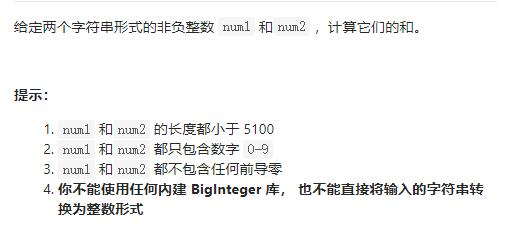

# 415-字符串相加




## 方法1：逆向双指针遍历（个数开始） + 进位处理 + 优化补0

算法流程： 设定 i，j 两指针分别指向 num1，num2 尾部，模拟人工加法；

- 计算进位： 计算 carry = Maht.floor(tmp / 10)，代表当前位相加是否产生进位；

- 添加当前位： 计算 tmp = n1 + n2 + carry，并将当前位 tmp % 10 添加至 res 头部；

- 索引溢出处理： 当指针 i 或 j 走过数字首部后，给 n1，n2 赋值为 0，相当于给 num1，num2 中长度较短的数字前面填 0，以便后续计算。

- 当遍历完 num1，num2 后跳出循环，并根据 carry 值决定是否在头部添加进位 1，最终返回 res 即可。

```js
// 写法1：统一处理2个数是否遍历到头，计算完后的进度问题
var addStrings = function (num1, num2) {
    let i = num1.length - 1,
        j = num2.length - 1,
        add = 0; //进位数
    let res = [];
    //判断2个数是否遍历到头，以及都遍历完后，是否还要进位
    while (i >= 0 || j >= 0 || add != 0) {
        let n1 = i >= 0 ? num1[i] - '0' : 0; //如果num1遍历完，后面补0
        let n2 = j >= 0 ? num2[j] - '0' : 0; //如果num2遍历完，后面补0
        let sum = n1 + n2 + add;
        res.push(sum % 10);
        add = Math.floor(sum / 10);
        i--;
        j--;
    }
    return res.reverse().join("");
};

// 写法2：单独处理计算完后的进度问题
var addStrings = function (num1, num2) {
    let i = num1.length - 1,
        j = num2.length - 1,
        add = 0;
    let res = [];
    while (i >= 0 || j >= 0) {
        let n1 = i >= 0 ? num1[i] - '0' : 0;
        let n2 = j >= 0 ? num2[j] - '0' : 0;
        let sum = n1 + n2 + add;
        res.push(sum % 10);
        add = Math.floor(sum / 10);
        i--;
        j--;
    }
    if (add != 0) res.push(1);
    return res.reverse().join("");
};
```


