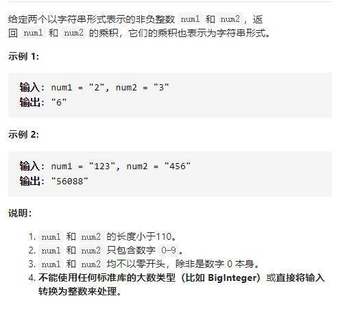

# 43-字符串相乘




## 方法1：竖式相乘-优化-各位数相加（从个位开始往前算）

乘数 num1 位数为 M，被乘数 num2 位数为 N， num1 x num2 结果 res 最大总位数为 M+N。

num1[i] x num2[j] 的结果为 tmp(位数为两位，"0x","xy"的形式)，其第一位位于 res[i+j]，第二位位于 res[i+j+1]。


```js
var multiply = function (num1, num2) {
    if (num1 === '0' || num2 === '0') { //排除结果为0的情况
        return '0'
    }
    let len1 = num1.length
    let len2 = num2.length
    let res = new Array(len1 + len2).fill(0) //两数相乘的结果位数为长度之和
    //从数字末尾个位数开始乘
    for (let i = len1 - 1; i >= 0; i--) {
        let n1 = num1[i] - '0'
        for (let j = len2 - 1; j >= 0; j--) {
            let n2 = num2[j] - '0'
            //相乘的结果加上之前的结果
            let sum = res[i + j + 1] + n1 * n2
            res[i + j + 1] = sum % 10 //取相加的个位数
            res[i + j] += Math.floor(sum / 10) //判断是否有进位，且进位数保存到数组前一位
        }
    }
    //去除前导0
    while (res[0] === 0) res.shift()
    return res.join("")
};
```

