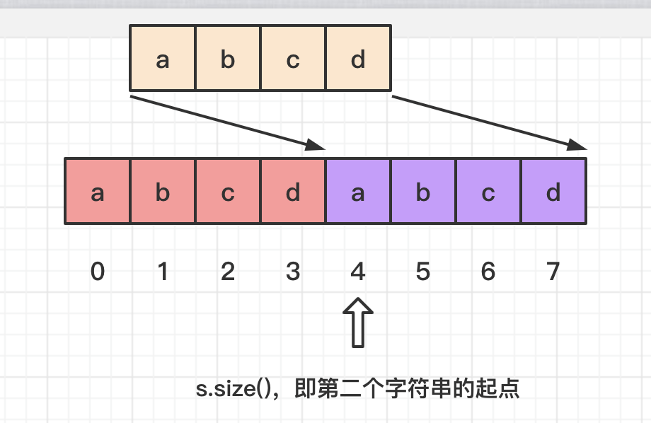

# 459-重复的子字符串

## 给定一个非空的字符串，判断它是否可以由它的一个子串重复多次构成。给定的字符串只含有小写英文字母，并且长度不超过10000。

```
示例 1:
输入: "abab"
输出: True
解释: 可由子字符串 "ab" 重复两次构成。

示例 2:
输入: "aba"
输出: False

示例 3:
输入: "abcabcabcabc"
输出: True
解释: 可由子字符串 "abc" 重复四次构成。 (或者子字符串 "abcabc" 重复两次构成。)
```


## 1.解法1 - 双倍字符串法 (从下标为1开始查找再判断)

### 当 s 有重复子串时：

### 例子:  s为"aabaabaab"，则 doubleS = s+s = "aabaabaabaabaabaab"，因此从doubleS中查找s时，结果肯定小于doubleS长度的一半（也就是s的长度）。这个例子的查找结果是2，而 2 != s.length。

### 图解:


### 当 s 没有重复子串时：

### 而如果是其他字符串，比如 "abcd"，则从"abcdabcd"中查找"abcd"时，结果肯定都等于组合字符串长度的一半（也就是s的长度），这里结果是3。

### 图解：



```js
var repeatedSubstringPattern = function (s) {
    //拼接两倍字符串, 再从第二个位置开始查找字符串s的位置
    //如果找出的位置不等于s的长度, 即s存在重复的子串。
    //如果找到的位置等于s的长度，即s不存在重复的子串
    return (s + s).indexOf(s, 1) != s.length;
};
```


## 2.解法2 - 双倍字符串法 (掐头去尾留中间)

### 假设 s 可由 子串 x 重复 n 次构成，即 s = nx

### 则有 s+s = 2nx

### 移除 s+s 开头和结尾的字符，变为 (s+s)[1:-1]，则破坏了开头和结尾的子串 x

### 此时只剩 2n-2 个子串

### 若 s 在 (s+s)[1:-1] 中，则有 2n-2 >= n，即 n >= 2

### 即 s 至少可由 x 重复 2 次构成

### 否则，n < 2，n 为整数，只能取 1，说明 s 不能由其子串重复多次构成

```js
var repeatedSubstringPattern = function (s) {
    //假设字符串有n个子串构成,则拼接后的子串为2n个,掐头去尾后为2n-2个,如果此时的字符串至少包含一个原字符串,则说明至少包含n个子串,则2n-2>=n,n>=2.则说明该字符串是周期性结构,最少由两个子串构成.如果一个都不包含,即不包含n个子串,则说明2n-2<n,n<2,即n为1,也就是不符合周期性结构.
    return (s + s).slice(1,-1).includes(s);
};
```


## 3.解法3：kmp

**时间复杂度：O(n)**

如果 next[len - 1] !=0

最长相等前后缀的长度为：next[len - 1]

数组长度为：len

如果 len % (len - next[len - 1] ) == 0 ，则说明 (数组长度-最长相等前后缀的长度) 正好可以被 数组的长度整除，说明有该字符串有重复的子字符串。

```js
var repeatedSubstringPattern = function (s) {
    if (s.length === 0) return false
    let n = s.length
    let next = new Array(n).fill(0)
    let j = 0
    for (let i = 1; i < n; i++) {
        while (j > 0 && s[i] != s[j]) {
            j = next[j - 1]
        }
        if (s[i] == s[j]) {
            j++
        }
        next[i] = j
    }
    //next[n - 1]是整个字符串最长相等前后缀的长度
    if (next[n - 1] != 0 && n % (n - next[n - 1]) == 0) return true
    return false
};
```

