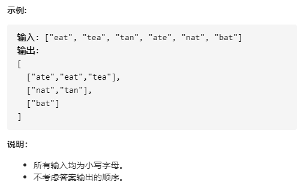

# 49-字母异位词分组

## 给定一个字符串数组，将字母异位词组合在一起。字母异位词指字母相同，但排列不同的字符串。




## 方法一：（暴力）排序 + 哈希map

### 时间复杂度：O(N KlogK)，其中 N 是 **strs** 的长度，而 K 是 **strs** 中字符串的最大长度。

### 空间复杂度：O(N K)

```javascript
var groupAnagrams = function (strs) {
    let map = new Map();
    for (let str of strs) {
        let s = str.split("").sort().join("");
        if (map.has(s)) {
            // let temp = map.get(s);
            // temp.push(str);
            // map.set(s, temp);
            // 等同于上面代码
            map.get(s).push(str);
        } else {
            map.set(s, [str]);
        }
    }
    // 1.利用扩展运算符...转化为数组直接输出
    // map.values()返回一个伪数组，即 map Iterator对象
    return [...map.values()];

    // 2.再创建个数组输出
    // let res = [];
    // for (let m of map) res.push(m[1]);
    // return res;
};
```


## 方法二：数组计数 + 哈希map

### 时间复杂度：O(N K)，其中 N 是 **strs** 的长度，而 K 是 **strs** 中字符串的最大长度。

### 空间复杂度：O(N K)

```javascript
var groupAnagrams = function (strs) {
    let map = new Map();
    for (let str of strs) {
        let keyArr = new Array(26).fill(0);
        for (let c of str) {
            keyArr[c.charCodeAt() - 'a'.charCodeAt()]++;
        }
        let key = keyArr.join('');
        map.has(key) ? map.get(key).push(str) : map.set(key, [str]);
    }
    return [...map.values()];
};
```


