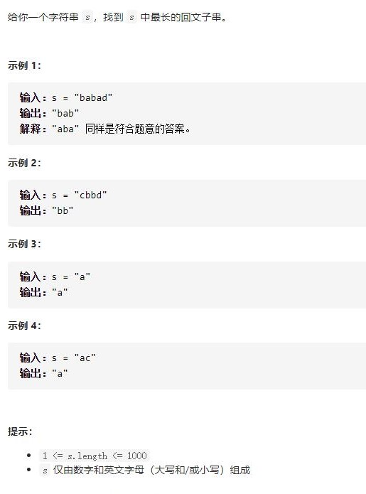

# 5-最长回文子串




## 方法1：中心扩展法 + 缓存回文子串长度

```js
var longestPalindrome = function (s) {
    let res = ""; //保存最长回文子串
    //单个字符中心数是length。2个字符中心数是length-1，加起来是2*length-1
    for (let center = 0; center < 2 * s.length - 1; center++) {
        let l = Math.floor(center / 2);
        let r = l + center % 2;
        while (l >= 0 && r < s.length && s[l] === s[r]) {
            let tmp = s.slice(l, r + 1); //得到当前回文子串
            if (tmp.length > res.length) res = tmp
            l--;
            r++;
        }
    }
    return res;
};
```


