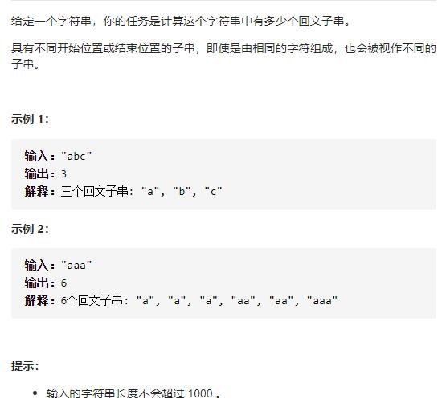
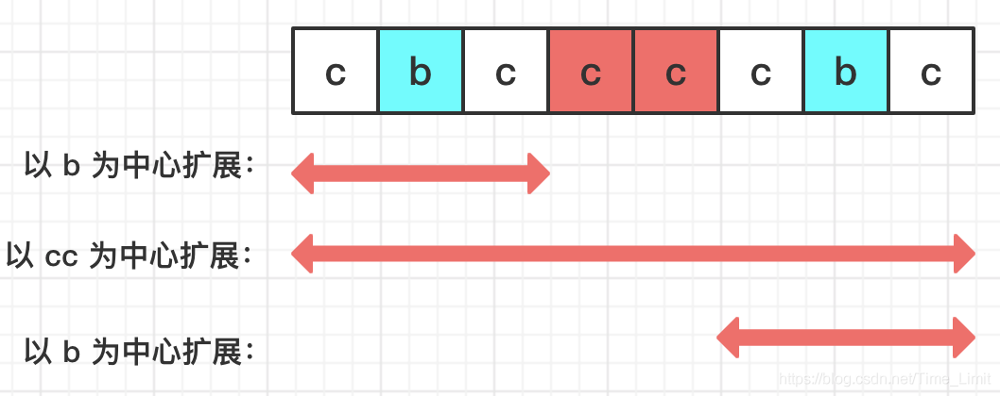

# 647-回文子串（个数）




## 方法1：中心扩展法

时间复杂度是 O(N^2)，空间复杂度是 O(1)。



```js
var countSubstrings = function (s) {
    let count = 0;
    //单个字符中心数是length。2个字符中心数是length-1，加起来是2*length-1
    for (let center = 0; center < 2 * s.length - 1; center++) {
        let l = Math.floor(center / 2);
        let r = l + center % 2;
        while (l >= 0 && r < s.length && s[l] === s[r]) {
            count++;
            l--;
            r++;
        }
    }
    return count;
};
```


