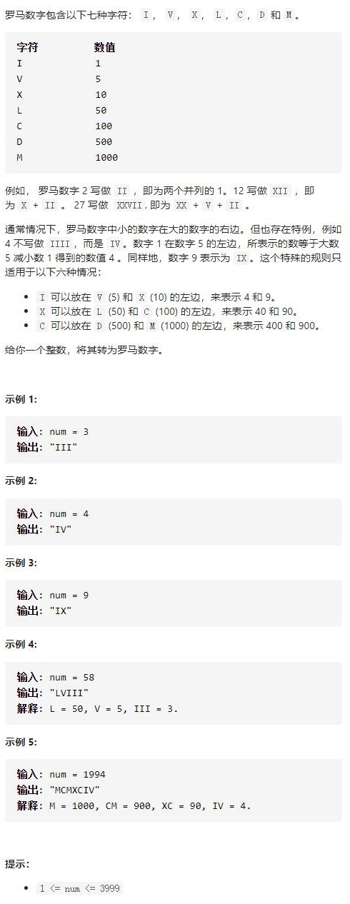

# 12-整数转罗马数字




## 方法1：模拟+二维数组

```js
var intToRoman = function (num) {
    let valsym = [[1000, "M"], [900, "CM"], [500, "D"], [400, "CD"], [100, "C"], [90, "XC"], [50, "L"], [40, "XL"], [10, "X"], [9, "IX"], [5, "V"], [4, "IV"], [1, "I"]];
    let res = ""
    //遍历键值数组
    for (let [val, sym] of valsym) {
        //num大于当前数值就减去，并用罗马字符表示
        while (num >= val) {
            num -= val
            res += sym
        }
        //减到0跳出
        if (num === 0) break
    }
    return res
};
```

