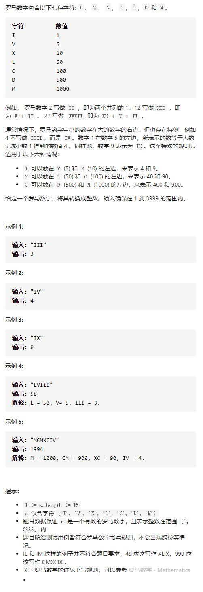

# 13-罗马数字转整数




## 方法1：模拟+哈希表

通常情况下，罗马数字中小的数字在大的数字的右边。若输入的字符串满足该情况，那么可以将每个字符视作一个单独的值，累加每个字符对应的数值即可。

例如XXVII可视作X＋X＋V＋I＋I = 10＋10＋5＋1＋1=27。

若存在小的数字在大的数字的左边的情况，根据规则需要减去小的数字。对于这种情况，我们也可以将每个字符视作一个单独的值，若一个数字右侧的数字比它大，则将该数字的符号取反。

例如XIV可视作X - I＋V=10 - 1＋5=14。

```js
var romanToInt = function (s) {
    let svals = {
        I: 1,
        V: 5,
        X: 10,
        L: 50,
        C: 100,
        D: 500,
        M: 1000
    }
    let res = 0
    for (let i = 0; i < s.length; i++) {
        //若当前字符代表的数字比后面小则减去当前数，即当前数加上负号
        if (i < s.length - 1 && svals[s[i]] < svals[s[i + 1]]) {
            res -= svals[s[i]]
        } else {
            res += svals[s[i]]
        }
    }
    return res
};
```

