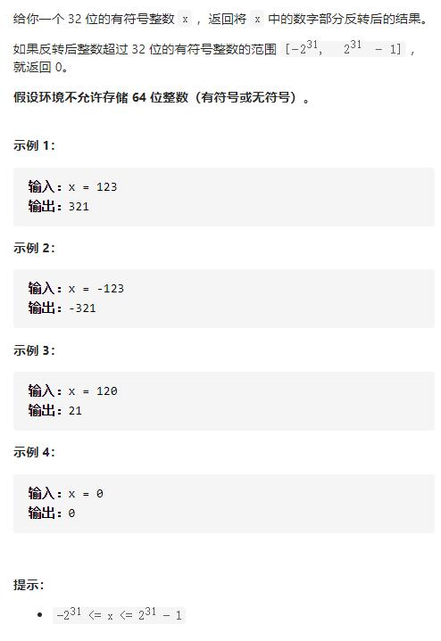

# 7-整数反转




## 方法1：末尾取数处理+数字溢出判断

类似9-回文数！

类似8-字符串转换整数 (atoi)！

**注意：**正数向下取整，负数向上取整。

```js
var reverse = function (x) {
    let max = Math.pow(2, 31) - 1,
        min = Math.pow(2, 31)
    let res = 0
    while (x !== 0) {
        let num = x % 10
        //注意：正数向下取整，负数向上取整
        x = x > 0 ? Math.floor(x / 10) : Math.ceil(x / 10)
        res = res * 10 + num
        if (res > max || res < -min) {
            return 0
        }
    }
    return res
};
```

