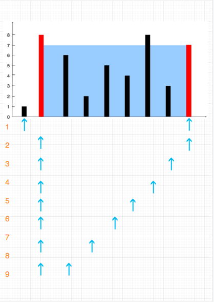

# 11-盛最多水的容器   一维数组的坐标变换！

给你 n 个非负整数 a1，a2，...，an，每个数代表坐标中的一个点 (i, ai) 。在坐标内画 n 条垂直线，垂直线 i 的两个端点分别为 (i, ai) 和 (i, 0)。找出其中的两条线，使得它们与 x 轴共同构成的容器可以容纳最多的水。

说明：你不能倾斜容器，且 n 的值至少为 2。


图中垂直线代表输入数组 [1,8,6,2,5,4,8,3,7]。在此情况下，容器能够容纳水（表示为蓝色部分）的最大值为 49。

**示例：**

输入：[1,8,6,2,5,4,8,3,7]
输出：49


## 方法一：暴力枚举：left bar x，right bar y，(y-x)*height_diff

### 时间复杂度：O(n^2)

### 空间复杂度：O(1)

```javascript
var maxArea = function (height) {
    var max = 0;
    for (var i = 0; i < height.length - 1; i++) {
        for (var j = i + 1; j < height.length; j++) {
            var area = (j - i) * Math.min(height[i], height[j]);
            max = Math.max(area, max);
        }
    }
    return max;
};
```


## 方法二：夹逼收敛：左右边界i,j 向中间收敛 ——双指针

### 时间复杂度：O(n)

### 空间复杂度：O(1)

### 根据面积计算规则，面积是由两个柱子的距离和柱子最低高度决定的。

### 所以，一开始前后指针指向第一根柱子和最后一根柱子，计算这两根柱子的面积，此时他们距离是最大的。

### 由于高度收到最低的限制，所以前后指针中高度最低的往中间移动，知道找到比它高的柱子（因为距离在减少，所以只有高度增大才有机会比之前的大），再重新计算面积，并和前面的比较，取最大值。直到前后指针重合。



```javascript
// 写法1
var maxArea = function (height) {
    var max = 0;
    for (var i = 0, j = height.length - 1; i < j;) {
        var minHeight = height[i] < height[j] ? height[i++] : height[j--];
        var area = (j - i + 1) * minHeight;
        max = Math.max(area, max);
    }
    return max;
};

//写法2
var maxArea = function (height) {
    var left = 0,
        right = height.length - 1,
        max = 0;
    while (left < right) {
        var now = (right - left) * Math.min(height[right], height[left]);
        max = now > max ? now : max;
        if (height[left] > height[right]) {
            right--;
        } else {
            left++;
        }
    }
    return max;
};
```


## 优化写法

```javascript
var maxArea = function (height) {
    var max = 0;
    for (var i = 0, j = height.length - 1; i < j;) {
        var area = height[i] < height[j] ?
            (j - i) * height[i++] : (j - i) * height[j--];
        max = Math.max(area, max);
    }
    return max;
};

//推荐
var maxArea = function (height) {
    var max = 0,
        i = 0,
        j = height.length - 1;
    while (i < j) {
        max = Math.max(max, (j - i) * Math.min(height[i], height[j]));
        height[i] < height[j] ? i++ : j--;
    }
    return max;
};

```


## 极简写法

```javascript
var maxArea = function (height) {
    var max = 0,
        i = 0,
        j = height.length - 1;
    while (i < j) {
        max = height[i] < height[j] ?
            Math.max(max, (j - i) * height[i++]) :
            Math.max(max, (j - i) * height[j--]);
    }
    return max;
};

// 超极简
var maxArea = function (height) {
    var x,
        y = 0,
        i = 0,
        j = height.length - 1;
    while (i < j) {
        if ((x = (j - i) * (height[i] > height[j] ? height[j--] : height[i++])) > y) {
            y = x;
        }
    }
    return y;
};

```

