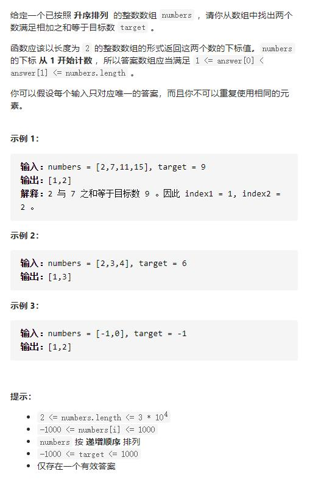

# 167-两数之和 II - 输入有序数组




## 方法1：双指针夹逼，按条件缩小搜索区间

1初始状态下，令left指向数组第一个元素，right指向最后一个元素

2进入循环，控制循环退出条件为left >= right

3在每一次循环中，如果left 与right 的数字之和等于所给target，则返回当前的left、right

4若left 与right 的数字之和小于所给target，left = left + 1，继续循环

5若left与right的数字之和大于所给target，right = right - 1，继续循环

```js
/**
 * @param {number[]} numbers
 * @param {number} target
 * @return {number[]}
 */
var twoSum = function (numbers, target) {
    let l = 0,
        r = numbers.length - 1
    while (l < r) {
        let sum = numbers[l] + numbers[r]
        if (sum === target) {
            return [l + 1, r + 1]
        } else if (sum > target) {
            r = r - 1
        } else {
            l = l + 1
        }
    }
    return []
};
```

